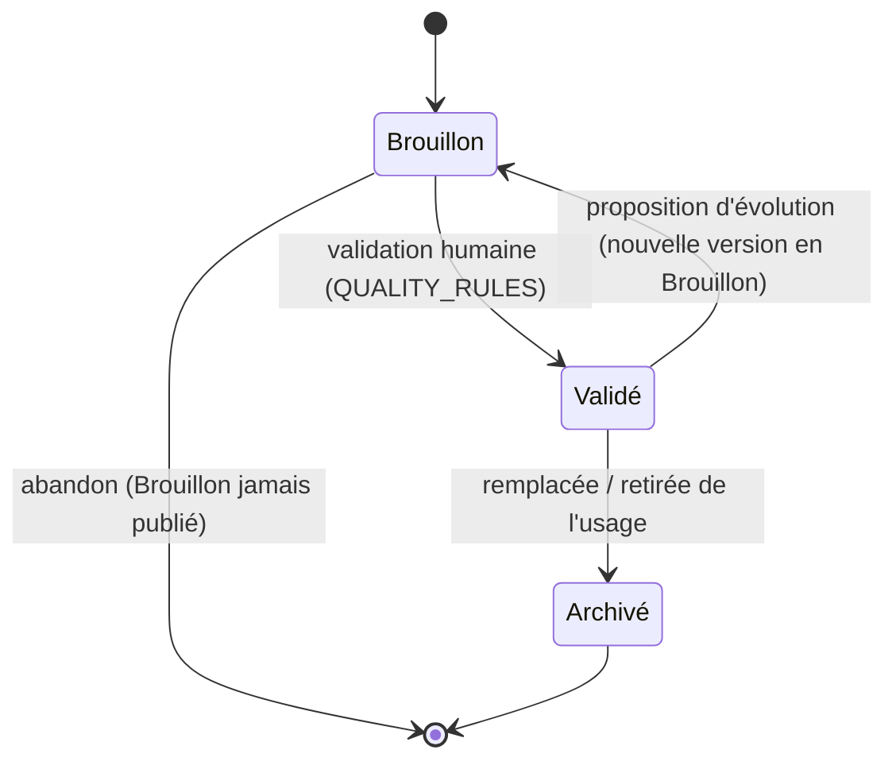

# Lifecycle — Cycle de vie d'une carte

> **Version** 1.0 — **Status** Validated — **Owner** Éditorial / Contenu métier — **Last Update** 2026-08-02
> **Depends On:** [../blueprint/engines/knowledge/KNOWLEDGE_LEARNING.md](../blueprint/engines/knowledge/KNOWLEDGE_LEARNING.md) — **Used By:** contributeurs, validateurs

## Objective
Décrire le cycle de vie **aligné sur l'objet `Knowledge` gelé** (Brouillon → Validé → Archivé).

## États
| État | Sens | Visible ? |
|---|---|---|
| **Brouillon** | en rédaction ou proposée | interne (non publiée) |
| **Validé** | relue et approuvée par un humain habilité | oui (selon `Visibility`) |
| **Archivé** | remplacée par une nouvelle version ou retirée de l'usage | historique (lecture seule) |

## Transitions (append-only)

## Règles
- Une **évolution** d'une carte validée crée une **nouvelle version en Brouillon** ; à sa validation,
  l'ancienne passe **Archivé**. L'historique est **conservé** (Loi 5, append-only).
- Un **Brouillon** peut être abandonné (jamais publié) sans impacter l'historique du contenu validé.
- **Aucune suppression** de carte validée/archivée sans **ADR**.

## Acteurs par transition
Création/évolution : Contributeur/Relecteur/IA (Brouillon). Validation/Archivage : **humain habilité**
(Validateur/Responsable) — voir [GOVERNANCE.md](GOVERNANCE.md).

## Changelog
- 1.0 (2026-08-02) — Cycle de vie initial.
