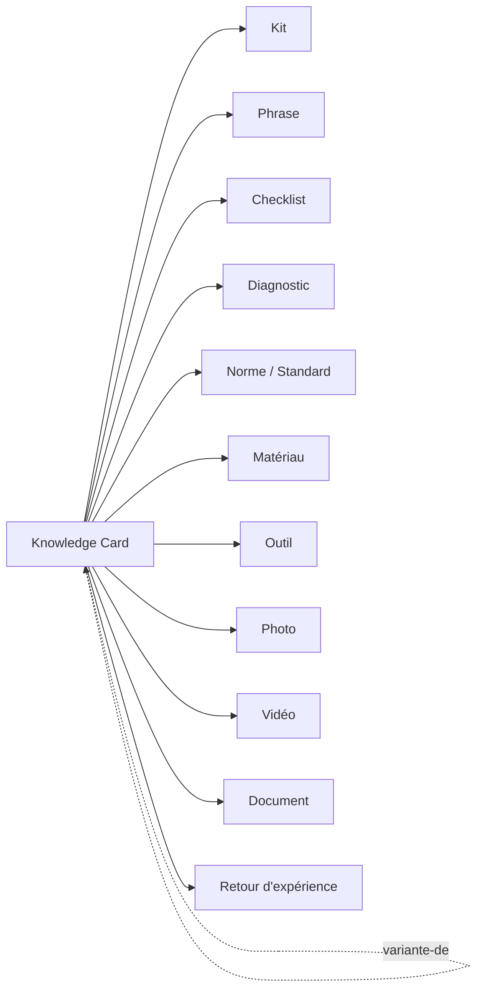

# Relationship Rules — Relations entre objets

> **Version** 1.0 — **Status** Validated — **Owner** Éditorial / Contenu métier — **Last Update** 2026-08-02
> **Depends On:** [../blueprint/engines/knowledge/KNOWLEDGE_RELATIONS.md](../blueprint/engines/knowledge/KNOWLEDGE_RELATIONS.md) — **Used By:** contributeurs, IA

## Objective
Définir toutes les relations possibles autour d'une **Knowledge Card**, en distinguant clairement
**objets du domaine** (référencés par id) et **éléments éditoriaux** (contenu du corpus).

## Deux natures d'éléments (règle de conformité)
| Nature | Éléments | Traitement |
|---|---|---|
| **Objet du domaine** (gelé) | `Kit`, `Phrase`, `Photo`/`Media`, `Document`, `Warranty`, `Maintenance` | **référence par id** vers l'objet existant |
| **Élément éditorial / facette** | Diagnostic, Checklist, Procédure, Matériau, Outil, Norme/Standard, FAQ, Retour d'expérience | **contenu du corpus** (fichier/section) + **tags** ; **pas** un objet persisté |

> Faire d'un élément éditorial un objet du domaine (ex. un référentiel `Material`/`Tool` persistant)
> exigerait un **ADR** (Knowledge Engine gelé). Ici : contenu éditorial uniquement.

## Graphe des relations

## Relations officielles (verbes)
| Relation | De → Vers | Sens |
|---|---|---|
| `utilise-kit` | Card → Kit | kit conseillé (objet `Kit`) |
| `cite-phrase` | Card → Phrase | texte réutilisable (objet `Phrase`) |
| `a-checklist` | Card → Checklist | contrôle éditorial |
| `traite-diagnostic` | Card → Diagnostic | problème traité (éditorial) |
| `respecte-norme` | Card → Standard | norme applicable (éditorial, sourcé) |
| `requiert-materiau` | Card → Matériau | matériau (éditorial) |
| `requiert-outil` | Card → Outil | outillage (éditorial) |
| `illustree-par` | Card → Photo/Vidéo/Media | média (objet `Photo`/`Media`) |
| `documentee-par` | Card → Document | pièce (objet `Document`) |
| `enrichie-par` | Card → Retour d'expérience | signal terrain (éditorial, entre par `Knowledge`) |
| `variante-de` | Card → Card | variante d'une carte-mère |
| `remplace` / `remplacee-par` | Card → Card | versionnement (voir VERSIONING) |

## Règles
- Toute relation est **par référence** (slug/id), jamais par copie (Loi 1 — source unique).
- Une relation **lie** ; un **tag classe** — ne pas confondre ([TAGGING.md](TAGGING.md)).
- Une relation cassée n'altère pas la carte (référence historique conservée).

## Changelog
- 1.0 (2026-08-02) — Relations initiales.
