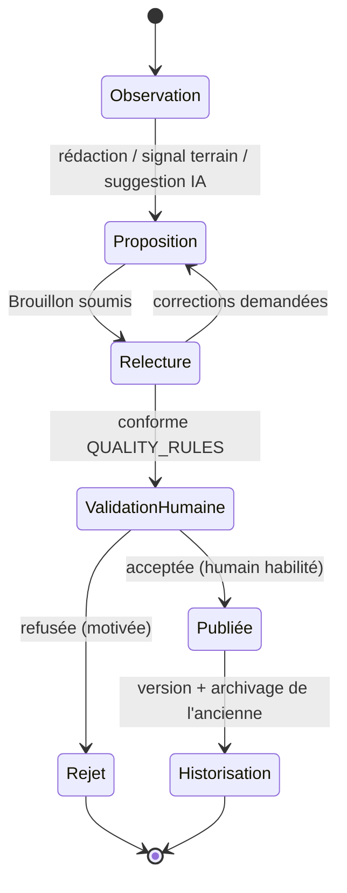

# Validation Process — Processus de validation

> **Version** 1.0 — **Status** Validated — **Owner** Éditorial / Contenu métier — **Last Update** 2026-08-02
> **Depends On:** [QUALITY_RULES.md](QUALITY_RULES.md), [../blueprint/engines/knowledge/KNOWLEDGE_LEARNING.md](../blueprint/engines/knowledge/KNOWLEDGE_LEARNING.md) — **Used By:** validateurs

## Objective
Garantir qu'aucune carte n'est publiée sans **validation humaine**, et qu'aucune évolution n'est
**silencieuse**.

## Le cycle obligatoire (aligné Knowledge Engine)

## Étapes
| Étape | Acteur | Sortie |
|---|---|---|
| Observation | contributeur / terrain / IA | intention/besoin |
| Proposition | contributeur / IA | carte/version **Brouillon** |
| Relecture | relecteur | conforme ou corrections |
| Validation | **validateur humain** | Validé + `BestPracticeValidated` (runtime) |
| Historisation | responsable | version conservée, ancienne archivée |

## Règles d'or
- **Aucune modification silencieuse** : une suggestion (y compris IA) est une **proposition**, jamais
  une écriture directe d'une carte validée (Loi 7/18).
- **Validation = humain habilité** ; l'IA ne valide jamais, n'invente jamais (traçable à ses sources).
- **Rejet motivé** conservé (traçabilité) ; le Brouillon rejeté n'est pas publié.

## Changelog
- 1.0 (2026-08-02) — Processus initial.
