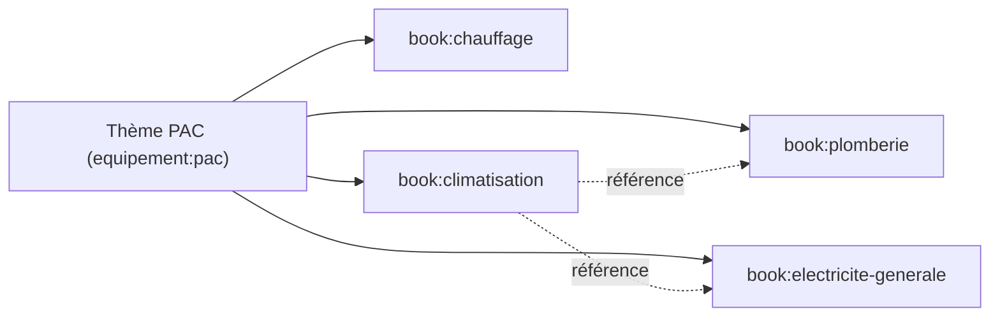

# Book Dependencies — Dépendances entre Livres

> **Version** 1.0 — **Status** Validated — **Owner** Éditorial / Contenu métier — **Last Update** 2026-08-02
> **Depends On:** [BOOK_SYSTEM.md](BOOK_SYSTEM.md) — **Used By:** responsables, navigation, IA

## Objective
Décrire comment un Livre **dépend** d'un autre — toujours par **référence**, jamais par copie.

## Nature des dépendances
- Une dépendance est un **renvoi** (`book:X` référence une carte/kit appartenant au périmètre de `book:Y`).
- Elle **n'importe pas** le contenu : la carte reste **possédée** par son Livre d'origine (source unique).

## Exemple (transversalité)

## Règles
- **Pas de cycle de contenu** : deux Livres peuvent se **référencer** mutuellement, mais aucune carte
  n'est dupliquée (une carte a **un** Livre propriétaire).
- Une dépendance cassée (carte dépréciée) **redirige** vers son remplacement ([../factory/DEPRECATION_POLICY.md](../factory/DEPRECATION_POLICY.md)).
- Les dépendances sont **documentées** dans le Livre (section « Livres liés »).

## Changelog
- 1.0 (2026-08-02) — Dépendances initiales.
