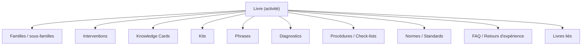

# Book Navigation — Navigation uniforme

> **Version** 1.0 — **Status** Validated — **Owner** Éditorial / Contenu métier — **Last Update** 2026-08-02
> **Depends On:** [BOOK_TEMPLATE.md](BOOK_TEMPLATE.md), [../taxonomy/SEARCH_INDEX.md](../taxonomy/SEARCH_INDEX.md) — **Used By:** lecteurs, UI, IA

## Objective
Garantir une navigation **identique** dans tous les Livres : depuis un Livre, on atteint immédiatement
familles, interventions, cards, kits, phrases, diagnostics, procédures, normes.

## Schéma de navigation (uniforme)

## Règles
- Chaque entrée de navigation est une **projection** (requête par tags de taxonomie), pas une copie.
- L'ordre et les libellés sont **homogènes** entre Livres (même gabarit, [BOOK_TEMPLATE.md](BOOK_TEMPLATE.md)).
- Depuis n'importe quelle carte, on remonte à **son** Livre et redescend aux entrées ci-dessus.
- La résolution des **alias** de tags ([../taxonomy/ALIASES.md](../taxonomy/ALIASES.md)) est transparente.

## Changelog
- 1.0 (2026-08-02) — Navigation initiale.
