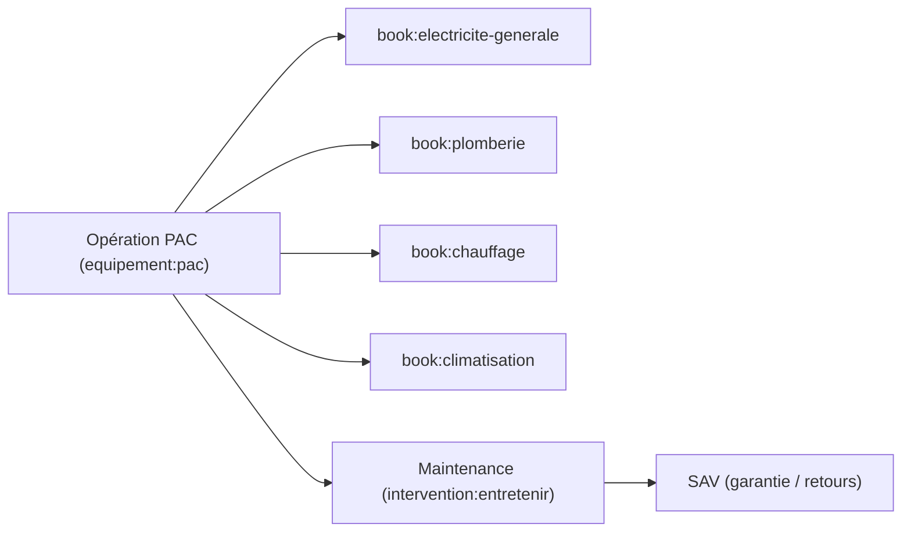

# Book Relationships — Collaboration entre Livres

> **Version** 1.0 — **Status** Validated — **Owner** Éditorial / Contenu métier — **Last Update** 2026-08-02
> **Depends On:** [BOOK_DEPENDENCIES.md](BOOK_DEPENDENCIES.md) — **Used By:** responsables, IA, navigation

## Objective
Décrire comment **plusieurs Livres collaborent** sur une opération transversale — par **référence**,
jamais par duplication.

## Exemple : une pompe à chaleur (PAC)
Une PAC n'est pas un Livre (ce n'est pas une activité) : c'est un **thème** (`equipement:pac`) qui
mobilise plusieurs Livres.

## Types de relation entre Livres
| Relation | Sens |
|---|---|
| `reference` | un Livre pointe une carte d'un autre Livre |
| `prerequis` | une opération suppose un geste d'un autre Livre (ex. raccordement élec.) |
| `complement` | Livres complémentaires sur une même opération |
| `maintenance-de` | un Livre couvre l'entretien/SAV d'un équipement d'un autre |

## Règles
- Toute collaboration passe par **référence** de slugs (`book:*`, carte), **jamais** par copie (Loi 1).
- Un thème transversal (PAC, borne IRVE, adoucisseur…) est porté par l'axe **équipement** + relations,
  **pas** par un Livre dédié (aligné taxonomie).
- Les relations sont **documentées** et **navigables** ([BOOK_NAVIGATION.md](BOOK_NAVIGATION.md)).

## Changelog
- 1.0 (2026-08-02) — Relations initiales.
