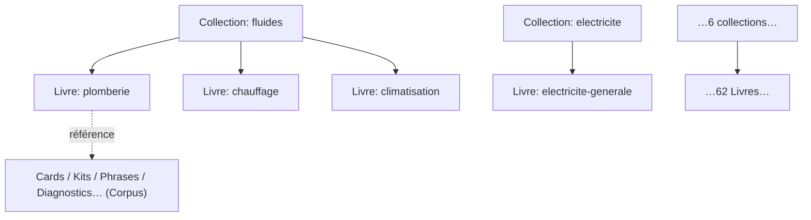

# Book System — Concept & invariants

> **Version** 1.0 — **Status** Validated — **Owner** Éditorial / Contenu métier — **Last Update** 2026-08-02
> **Depends On:** [README.md](README.md), [../taxonomy/PROFESSIONS.md](../taxonomy/PROFESSIONS.md) — **Used By:** responsables, IA

## Objective
Décrire ce qu'est un Livre, sa structure, et les invariants qui garantissent la cohérence à grande échelle.

## Un Livre = une unité éditoriale par activité
- **Domaine cohérent** : un Livre couvre **une activité** de la taxonomie gelée (ex. `plomberie`).
- **Unité de** : édition, maintenance, versionnement, évolution, publication.
- **Curation par références** : il **sélectionne** (par tags de taxonomie) des éléments du Corpus ;
  il n'en **détient** aucun (zéro duplication — Loi 1).

## Structure (2 niveaux, miroir de la taxonomie)

## Invariants
1. **Aligné taxonomie** : Collection = famille (6), Livre = activité (62) — jamais une unité hors taxonomie.
2. **Zéro duplication** : un Livre référence ; une même carte peut être **référencée** par plusieurs Livres (relation), jamais **copiée**.
3. **Respecte la Factory** : le contenu référencé est produit/validé par la [Factory](../factory/README.md).
4. **Navigable, versionné, traçable** ([BOOK_NAVIGATION.md](BOOK_NAVIGATION.md), [BOOK_VERSIONING.md](BOOK_VERSIONING.md)).
5. **Évolution structurelle = ADR** (créer/fusionner/scinder/archiver un Livre, ajouter une profession).

## Cas « transversal » (ex. PAC)
Une **pompe à chaleur** n'est pas une activité de la taxonomie : c'est un **équipement** (`equipement:pac`)
touchant plusieurs Livres (`plomberie`, `electricite`, `chauffage`/`climatisation`). Elle **n'est donc
pas un Livre** : elle est traitée par les **relations entre Livres** ([BOOK_RELATIONSHIPS.md](BOOK_RELATIONSHIPS.md))
et l'axe équipement. C'est précisément ce qui garde le système aligné sur la taxonomie.

## Changelog
- 1.0 (2026-08-02) — Concept initial.
