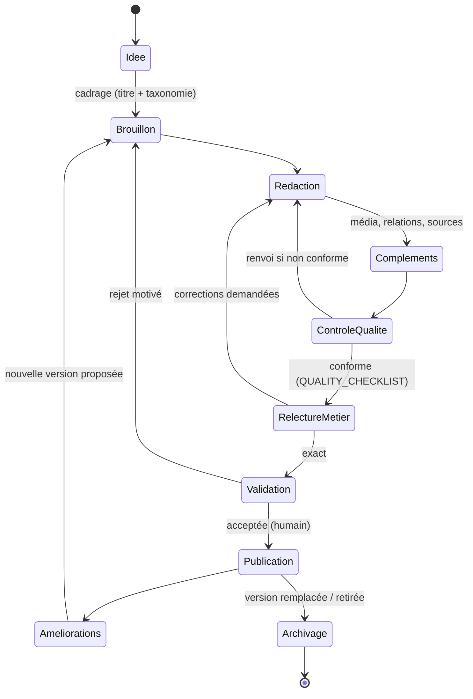

# Editorial Workflow — Workflow éditorial

> **Version** 1.0 — **Status** Validated — **Owner** Éditorial / Contenu métier — **Last Update** 2026-08-02
> **Depends On:** [../VALIDATION_PROCESS.md](../VALIDATION_PROCESS.md), [CARD_LIFECYCLE.md](CARD_LIFECYCLE.md) — **Used By:** tous les acteurs

## Objective
Définir le **chemin unique** d'une carte, de l'idée à l'archivage.

## Les 10 étapes

## Correspondance avec le cycle de vie (gelé)
| Étape workflow | État de la carte ([../LIFECYCLE.md](../LIFECYCLE.md)) |
|---|---|
| Idée → … → Validation | **Brouillon** |
| Publication | **Validé** |
| Améliorations | nouvelle version en **Brouillon** |
| Archivage | **Archivé** |

## Règles
- **Aucune étape sautée** sans raison documentée (analogue du Validation Gate).
- **Rien n'est publié** sans passer Contrôle qualité + Relecture + **Validation humaine**.
- Toute évolution repasse par le workflow (pas de modification en place d'une carte validée).

## Changelog
- 1.0 (2026-08-02) — Workflow initial.
