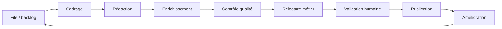

# Knowledge Pipeline — Pipeline & production à grande échelle

> **Version** 1.0 — **Status** Validated — **Owner** Éditorial / Contenu métier — **Last Update** 2026-08-02
> **Depends On:** [KNOWLEDGE_FACTORY.md](KNOWLEDGE_FACTORY.md), [KNOWLEDGE_QUEUE.md](KNOWLEDGE_QUEUE.md) — **Used By:** responsables de production

## Objective
Décrire le **pipeline** et **comment monter en volume sans perdre la qualité**.

## Pipeline (flux continu)

Chaque carte est **indépendante** : une carte en validation n'attend pas les autres (pas de barrière
globale). Le débit = capacité du poste le plus lent (souvent la **relecture/validation** humaine).

## Paliers de production (sans perte de qualité)
| Volume | Organisation |
|---|---|
| **10** | 1 auteur + 1 validateur ; rodage du modèle et de la checklist |
| **100** | lots par **activité** ; gabarits par famille ; IA en pré-rédaction |
| **1 000** | plusieurs auteurs en parallèle ; IA en enrichissement/pré-relecture ; file priorisée |
| **10 000** | production par **famille**, validateurs experts par métier ; contrôles automatisés en amont |
| **100 000** | fédération d'experts ; IA à chaque poste (proposition) ; validation humaine **jamais** supprimée |

## Règles d'échelle (invariantes)
- **La validation humaine ne se parallélise pas au point de disparaître** : chaque carte est validée individuellement.
- On augmente le débit en ajoutant des **postes/acteurs**, jamais en **retirant un contrôle**.
- L'IA absorbe le volume **en amont** (cadrage, rédaction, enrichissement, détection de doublons) ; l'humain garde la **décision**.
- Les **doublons** sont détectés avant rédaction ([../taxonomy/SEARCH_INDEX.md](../taxonomy/SEARCH_INDEX.md), [CHANGE_POLICY.md](CHANGE_POLICY.md)).

## Goulots & parades
| Goulot | Parade |
|---|---|
| Relecture/validation humaine | prioriser la file, spécialiser par métier, pré-contrôles IA |
| Doublons à l'échelle | recherche taxonomique systématique avant cadrage |
| Dérive de qualité | checklist + score identiques ; audit d'échantillons |

## Changelog
- 1.0 (2026-08-02) — Pipeline initial.
