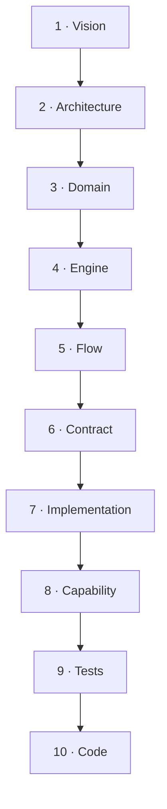

# Cartographie documentaire — Le Blueprint vivant

> **Version** 1.0 — **Status** Living — **Owner** Architecture — **Last Update** 2026-08-02
> **Depends On:** [INDEX.md](INDEX.md) — **Used By:** tout lecteur (humain ou IA) — **Niveau:** 1 · Vision

## Objective
Carte unique du référentiel : **où se trouve l'autorité**, dans quel ordre lire, et comment un niveau
dépend du précédent — de la **Vision** jusqu'au **Code**. Ce document **ne duplique aucun contenu** :
il **relie** les sources officielles. Pour la traçabilité **par fonctionnalité**, voir
[audit/TRACEABILITY_REPORT.md](audit/TRACEABILITY_REPORT.md) (source unique).

## Chaîne documentaire

## Carte des niveaux (source, propriétaire, dépendances, consommateurs)
| # | Niveau | Source officielle | Propriétaire | Dépend de | Consommateurs |
|---|---|---|---|---|---|
| 1 | **Vision** | [manifesto/](manifesto/README.md), [product/](product/README.md), [docs/BRAND.md](../BRAND.md) | Product Owner | — | tous les niveaux |
| 2 | **Architecture** | [architecture/](architecture/README.md), [constitution/](constitution/README.md), [adr/](adr/README.md) | Architecture | Vision | Domain → Code |
| 3 | **Domain** | [domain/OBJECT_CATALOG.md](domain/OBJECT_CATALOG.md) | propriétaires d'objets | Architecture | Engine, Flow, Contract |
| 4 | **Engine** | [engines/ENGINE_MAP.md](engines/ENGINE_MAP.md) (+ approfondissement [engines/knowledge/](engines/knowledge/README.md)) | équipe moteur | Domain | Flow, Contract, Impl |
| 5 | **Flow** | [flows/FLOW_INDEX.md](flows/FLOW_INDEX.md) | Product/Architecture | Domain, Engine | Contract, Impl |
| 6 | **Contract** | [contracts/CONTRACT_INDEX.md](contracts/CONTRACT_INDEX.md) | Architecture | Flow | Implementation, Code |
| 7 | **Implementation** | [implementation/README.md](implementation/README.md) | Lead Engineer | Contract | Capability, Code |
| 8 | **Capability** | [implementation/CAPABILITY_LEDGER.md](implementation/CAPABILITY_LEDGER.md) (+ [reports/](implementation/reports/README.md)) | Lead Engineer | Impl + niveaux 1–6 | Tests, Code |
| 9 | **Tests** | `backend/app/tests/`, `frontend/test/` (dépôt) | équipe QA/dev | Capability | Code (preuve) |
| 10 | **Code** | `backend/app/`, `frontend/lib/` (dépôt) | équipe dev | tous | produit |

## Règle d'or de lecture
Chaque niveau **applique** le précédent et ne le contredit jamais. En cas de doute, l'autorité remonte :
Code → Tests → Capability → Implementation → Contract → Flow → Engine → Domain → Architecture → Vision.
La **Vision** ([BRAND.md](../BRAND.md)) est le document le plus stable ; tout le reste peut évoluer par ADR.

## Depuis n'importe quel document
- **Index général** : [INDEX.md](INDEX.md) · **Audit/état** : [audit/README.md](audit/README.md)
- **Décisions** : [adr/README.md](adr/README.md) · **Glossaire** : [glossary/GLOSSARY.md](glossary/GLOSSARY.md)
- **Traçabilité par fonctionnalité** : [audit/TRACEABILITY_REPORT.md](audit/TRACEABILITY_REPORT.md)
- **Cartographie des dépendances** : [audit/DEPENDENCY_REPORT.md](audit/DEPENDENCY_REPORT.md)

## Gouvernance
Ce document est **vivant** (navigation), pas une décision figée. Toute évolution **structurelle** du
Blueprint (déplacer/renommer/supprimer/fusionner un document) exige un **ADR** — voir
[audit/OPEN_DECISIONS.md](audit/OPEN_DECISIONS.md).

## Related Documents
[INDEX.md](INDEX.md) · [README.md](README.md) · [audit/TRACEABILITY_REPORT.md](audit/TRACEABILITY_REPORT.md)

## Next Reading
[INDEX.md](INDEX.md)

## Changelog
- 1.0 (2026-08-02) — Cartographie initiale (mission d'intégration).
