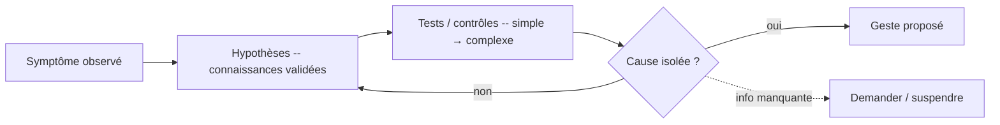

# Diagnostic Reasoning — Raisonnement diagnostique

> **Version** 1.0 — **Status** Validated — **Owner** Business Intelligence — **Last Update** 2026-08-02
> **Depends On:** [PROBLEM_SOLVING.md](PROBLEM_SOLVING.md) — **Used By:** Decision, AI Companion — **Niveau:** 2 · Architecture

## Objective
Décrire comment l'artisan **trouve la cause** avant d'agir.

## Chaîne diagnostique

## Règles
- **Symptôme ≠ cause** : on remonte à la **cause unique** avant tout remplacement.
- Hypothèses **fondées** sur des diagnostics/cartes validés ([../../knowledge/diagnostics/](../../knowledge/diagnostics/README.md)), classées par **probabilité** et **facilité de test**.
- Tests **du simple au complexe** ; distinguer les faux positifs (ex. condensation vs fuite).
- **Ne jamais conclure sous incertitude** : information manquante → [UNCERTAINTY.md](UNCERTAINTY.md).
- Le niveau de **confiance** du diagnostic est affiché (A/B/C/D — [../../knowledge/factory/CONFIDENCE_MODEL.md](../../knowledge/factory/CONFIDENCE_MODEL.md)).

## Sortie
Une **cause probable** + son niveau de confiance + le **geste** correspondant (proposé, à valider).

## Changelog
- 1.0 (2026-08-02) — Raisonnement diagnostique initial.
