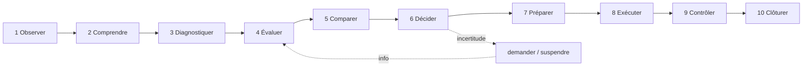

# Reasoning Model — Le raisonnement en 10 temps

> **Version** 1.0 — **Status** Validated — **Owner** Business Intelligence — **Last Update** 2026-08-02
> **Depends On:** [CORE_BUSINESS_INTELLIGENCE.md](CORE_BUSINESS_INTELLIGENCE.md) — **Used By:** Decision, AI Companion — **Niveau:** 2 · Architecture

## Objective
Décrire la **séquence de raisonnement** d'un artisan expérimenté.

## Les 10 temps

## Détail
| # | Temps | Question de l'artisan | Appui |
|---|---|---|---|
| 1 | Observer | qu'est-ce que je vois ? (état, indices, photos) | contexte |
| 2 | Comprendre | quelle est l'intention/le besoin réel ? | intention |
| 3 | Diagnostiquer | quelle est la cause ? | [DIAGNOSTIC_REASONING.md](DIAGNOSTIC_REASONING.md) |
| 4 | Évaluer | quels risques, quelles contraintes ? | [RISK_ANALYSIS.md](RISK_ANALYSIS.md) |
| 5 | Comparer | quelles solutions, laquelle convient ? | connaissances validées |
| 6 | Décider | que proposer ? (l'artisan tranche) | [HUMAN_VALIDATION.md](HUMAN_VALIDATION.md) |
| 7 | Préparer | outillage, matériel, procédure, sécurité | kits/procédures/check-lists |
| 8 | Exécuter | réaliser le geste | (coordination : Orchestration) |
| 9 | Contrôler | vérifier (étanchéité, sécurité, conformité) | check-lists/contrôles |
| 10 | Clôturer | garantie, SAV, traçabilité | garanties/historique |

## Règles
- La séquence **boucle** sur l'incertitude (temps 4/5) : si l'information manque, on **demande/suspend**, on n'invente pas.
- Chaque temps s'appuie sur des **connaissances validées** ; les temps 6 et 8+ n'ont lieu **qu'après validation** humaine.

## Correspondance
Ce modèle **nourrit** le pipeline du Decision Engine ([../engines/decision/DECISION_PIPELINE.md](../engines/decision/DECISION_PIPELINE.md)) et l'exécution de l'Orchestration Engine.

## Changelog
- 1.0 (2026-08-02) — Modèle initial (10 temps).
