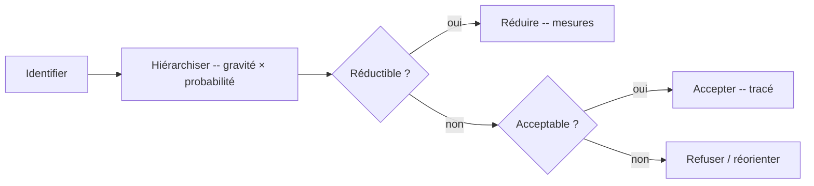

# Risk Analysis — Analyse des risques

> **Version** 1.0 — **Status** Validated — **Owner** Business Intelligence — **Last Update** 2026-08-02
> **Depends On:** [REASONING_MODEL.md](REASONING_MODEL.md) — **Used By:** Decision, AI Companion — **Niveau:** 2 · Architecture

## Objective
Décrire comment un professionnel **identifie, hiérarchise, réduit, accepte** un risque — ou **refuse** une intervention.

## Démarche

## Hiérarchisation (gravité × probabilité)
| | Faible probabilité | Forte probabilité |
|---|---|---|
| **Gravité élevée** (sécurité) | à réduire impérativement | **refus** si non réductible |
| **Gravité faible** | acceptable (tracé) | à réduire si simple |

## Règles
- **Sécurité = priorité absolue** : un risque grave non réductible → **refus** d'intervenir (ou réorientation vers qualifié).
- Un risque accepté est **explicité et tracé** (jamais implicite).
- Le raisonnement s'appuie sur des **normes/sécurité** de niveau A/B ; un point de sécurité en C/D **suspend** ([UNCERTAINTY.md](UNCERTAINTY.md)).
- Hors **qualification d'exercice** : ne pas proposer un travail réservé comme banal.

## Changelog
- 1.0 (2026-08-02) — Analyse des risques initiale.
