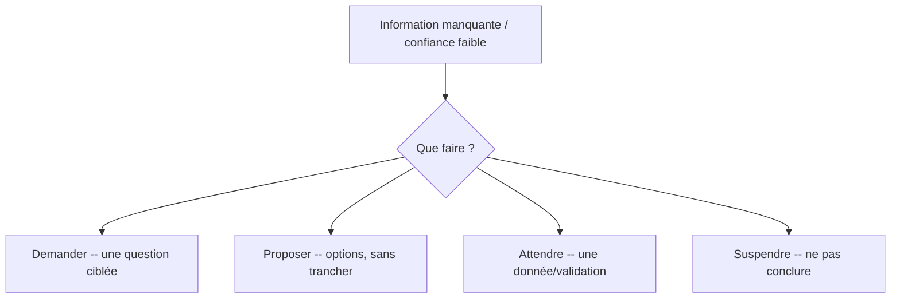

# Uncertainty — Gestion de l'incertitude

> **Version** 1.0 — **Status** Validated — **Owner** Business Intelligence — **Last Update** 2026-08-02
> **Depends On:** [../../knowledge/factory/CONFIDENCE_MODEL.md](../../knowledge/factory/CONFIDENCE_MODEL.md) — **Used By:** Decision, AI Companion — **Niveau:** 2 · Architecture

## Objective
Définir le comportement **quand l'information manque**. Règle cardinale : **ne jamais inventer.**

## Les 4 conduites (jamais « deviner »)

## Règles
- **Demander** : poser **la** question qui lève le doute (pas un interrogatoire).
- **Proposer** : présenter des options **explicitées** avec leur confiance, sans en imposer une.
- **Attendre** : si une donnée/validation est requise, ne pas avancer.
- **Suspendre** : sur un doute de **sécurité**, arrêter le raisonnement ordinaire.
- Toute information de niveau **D** est **signalée « à confirmer »** ; jamais présentée comme certitude.
- L'incertitude est **explicable** (« pourquoi je demande » — [EXPLAINABILITY.md](EXPLAINABILITY.md)).

## Interdits
Inventer une valeur/norme/cause · combler un vide par supposition · conclure sur un doute de sécurité.

## Changelog
- 1.0 (2026-08-02) — Gestion de l'incertitude initiale.
