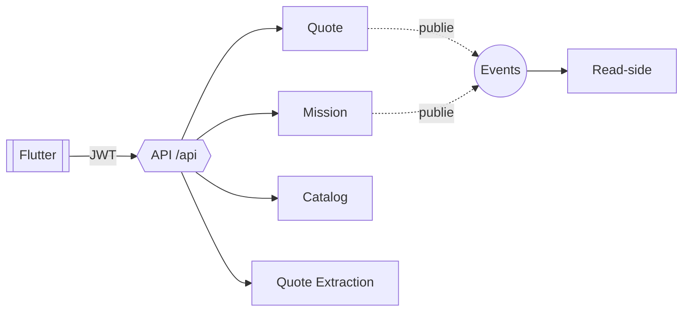

# API Contracts — Conventions REST

> **Version** 1.0 — **Status** Frozen — **Owner** Architecture — **Last Update** 2026-08-02
> **Depends On:** [CONTRACT_INDEX.md](CONTRACT_INDEX.md) — **Used By:** contracts/rest-api, implementation — **Niveau:** 2 · Architecture

## Objective
Fixer la forme de chaque endpoint REST. Modèle par endpoint : [../templates/API_TEMPLATE.md](../templates/API_TEMPLATE.md).

## Forme d'un endpoint
| Élément | Règle |
|---|---|
| **URI** | `/(api)/<ressource>[/<id>][/<sous-ressource>]`, noms au pluriel, minuscules |
| **Méthode** | GET (lecture) · POST (création/commande) · PUT/PATCH (transition, jamais recalcul caché) · DELETE (brouillon) |
| **Entrée** | DTO validé ; `company_id` **jamais** en paramètre client |
| **Sortie** | DTO de réponse stable ; enveloppe cohérente |
| **Codes HTTP** | 200/201/204 · 400/401/403/404/409/413/415/422 · 429 · 5xx |
| **Erreurs** | enveloppe unique `{error:{code,message}}` ([ERROR_CONTRACTS.md](ERROR_CONTRACTS.md)) |
| **Permissions** | garde Authentication+Authorization ; mismatch tenant → **404** |
| **Événements** | publie ses événements de domaine (jamais silencieux) |
| **Performance** | lecture < ~300 ms ; traitement long → asynchrone + notification |
| **Idempotence** | GET/PUT/DELETE idempotents ; POST de création protégé (clé/anti double-création) |

## API Map (Mermaid)

## Rules
Une API n'expose que des DTO (jamais un objet interne). Toute évolution respecte [VERSIONING_POLICY.md](VERSIONING_POLICY.md).

## Acceptance Criteria
Chaque endpoint a URI, méthode, entrée/sortie, codes, erreurs, permissions, événements, performance, idempotence.

## Related Documents
[DTO_CONTRACTS.md](DTO_CONTRACTS.md) · [ERROR_CONTRACTS.md](ERROR_CONTRACTS.md) · [SECURITY_CONTRACTS.md](SECURITY_CONTRACTS.md)

## Next Reading
[EVENT_CONTRACTS.md](EVENT_CONTRACTS.md)

## Changelog
- 1.0 (2026-08-02) — Conventions API + map initiales.
