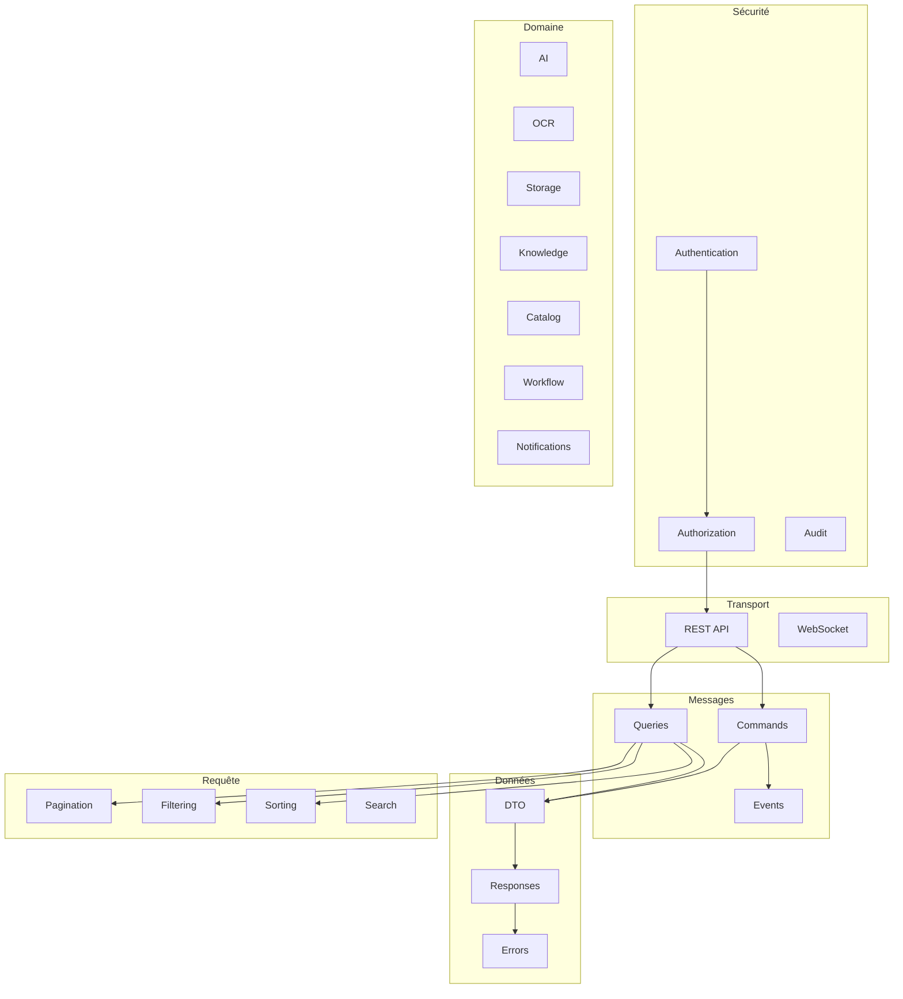

# Contract Index — Catalogue des contrats

> **Version** 1.0 — **Status** Frozen — **Owner** Architecture — **Last Update** 2026-08-02
> **Depends On:** [README.md](README.md) — **Used By:** contracts/, implementation — **Niveau:** 2 · Architecture

## Objective
Recenser toutes les catégories de contrats et donner la vue d'ensemble (Contract Landscape).

## Catégories (26)
| Catégorie | Type | Fiche |
|---|---|---|
| REST API | transport | [contracts/rest-api.md](contracts/rest-api.md) |
| WebSocket | transport | [contracts/websocket.md](contracts/websocket.md) |
| Events | message | [contracts/events.md](contracts/events.md) |
| Commands | message | [contracts/commands.md](contracts/commands.md) |
| Queries | message | [contracts/queries.md](contracts/queries.md) |
| DTO | donnée | [contracts/dto.md](contracts/dto.md) |
| Responses | donnée | [contracts/responses.md](contracts/responses.md) |
| Errors | donnée | [contracts/errors.md](contracts/errors.md) |
| Pagination | requête | [contracts/pagination.md](contracts/pagination.md) |
| Filtering | requête | [contracts/filtering.md](contracts/filtering.md) |
| Sorting | requête | [contracts/sorting.md](contracts/sorting.md) |
| Search | requête | [contracts/search.md](contracts/search.md) |
| Import | échange | [contracts/import.md](contracts/import.md) |
| Export | échange | [contracts/export.md](contracts/export.md) |
| Upload | échange | [contracts/upload.md](contracts/upload.md) |
| Download | échange | [contracts/download.md](contracts/download.md) |
| Authentication | sécurité | [contracts/authentication.md](contracts/authentication.md) |
| Authorization | sécurité | [contracts/authorization.md](contracts/authorization.md) |
| Audit | sécurité | [contracts/audit.md](contracts/audit.md) |
| Notifications | domaine | [contracts/notifications.md](contracts/notifications.md) |
| AI | domaine | [contracts/ai.md](contracts/ai.md) |
| OCR | domaine | [contracts/ocr.md](contracts/ocr.md) |
| Storage | domaine | [contracts/storage.md](contracts/storage.md) |
| Knowledge | domaine | [contracts/knowledge.md](contracts/knowledge.md) |
| Catalog | domaine | [contracts/catalog.md](contracts/catalog.md) |
| Workflow | domaine | [contracts/workflow.md](contracts/workflow.md) |

## Contract Landscape (Mermaid)

## Related Documents
[API_CONTRACTS.md](API_CONTRACTS.md) · [DTO_CONTRACTS.md](DTO_CONTRACTS.md) · [COMPATIBILITY_RULES.md](COMPATIBILITY_RULES.md)

## Next Reading
[API_CONTRACTS.md](API_CONTRACTS.md)

## Changelog
- 1.0 (2026-08-02) — Catalogue + landscape initiaux.
