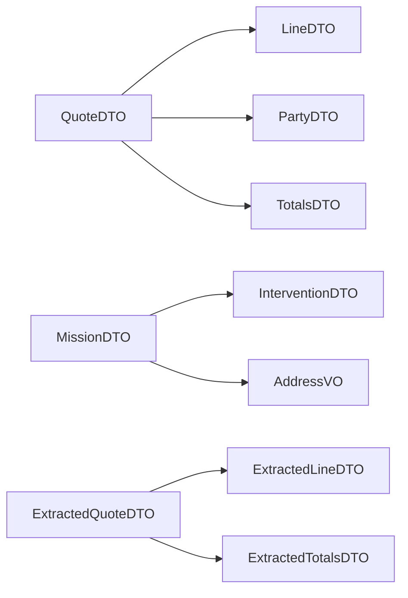

# DTO Contracts — Objets échangés

> **Version** 1.0 — **Status** Frozen — **Owner** Architecture — **Last Update** 2026-08-02
> **Depends On:** [CONTRACT_INDEX.md](CONTRACT_INDEX.md) — **Used By:** contracts/dto, API, IA — **Niveau:** 2 · Architecture

## Objective
Décrire tout objet transféré (jamais un objet interne). Un DTO est une **projection stable** d'un objet du Domain Model.

## Règles de forme
| Élément | Règle |
|---|---|
| **Structure** | plate et explicite ; un DTO par intention (lecture/écriture), pas un « DTO God » |
| **Types** | `string`, `integer`, `decimal (string)`, `boolean`, `uuid`, `date (ISO 8601)`, listes, objets imbriqués |
| **Formats** | dates `AAAA-MM-JJ` ; **montants en `decimal` sérialisé en chaîne** (zéro perte, cf. moteur d'extraction) |
| **Unités** | explicites (unité d'article, minutes pour le temps) ; jamais implicites |
| **Valeurs nulles** | `null` = absence documentée (jamais « inconnu » ambigu) ; chaque champ dit s'il est nullable |
| **Propriété** | chaque champ a un **objet/moteur propriétaire** (pas de champ orphelin) |
| **Compatibilité** | ajout de champ optionnel = mineur ; suppression/renommage = breaking (ADR) |
| **Exemples** | chaque DTO fournit un exemple JSON valide |

## DTO Map (Mermaid)

## Rules
Un DTO n'expose jamais un secret ni une donnée d'un autre tenant. Un montant reste une chaîne décimale (fidélité). Nulls explicites.

## Acceptance Criteria
Chaque DTO a structure, types, formats, unités, règle des nulls, propriétaire, compatibilité et exemple.

## Related Documents
[ERROR_CONTRACTS.md](ERROR_CONTRACTS.md) · [../domain/OBJECT_CATALOG.md](../domain/OBJECT_CATALOG.md)

## Next Reading
[ERROR_CONTRACTS.md](ERROR_CONTRACTS.md)

## Changelog
- 1.0 (2026-08-02) — Conventions DTO + map initiales.
