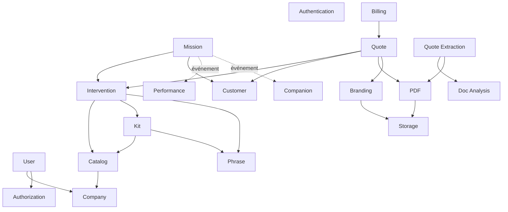

# Engine Dependencies — Matrice de dépendances

> **Version** 1.0 — **Status** Frozen — **Owner** Architecture — **Last Update** 2026-08-02
> **Depends On:** [ENGINE_MAP.md](ENGINE_MAP.md) — **Used By:** engines/, implementation — **Niveau:** 2 · Architecture

## Objective
Fixer, pour chaque moteur, ses dépendances **autorisées** et **interdites**, avec la raison. Sens unique, jamais de cycle (Loi 16/17).

## Règle de sens
Les dépendances vont **vers le bas** des couches (L3 peut utiliser L2/L1/L0 ; jamais l'inverse). Les moteurs **read-side (L6)** ne dépendent du cœur que **par événement** (jamais d'appel direct, Loi 7).

## Matrice (moteurs structurants)
| Moteur | Dépend de | Utilisé par | Publie vers (événements) | Écoute | **Interdit d'utiliser** |
|---|---|---|---|---|---|
| Authentication | Settings | tous (garde) | — | — | objets métier |
| Authorization | User (Role) | tous (garde) | — | — | logique métier |
| Company | Storage | User, tout tenant | Company* | — | Mission, Quote |
| User | Company, Authorization | tous | User* | — | objets d'un autre tenant |
| Catalog | Company | Intervention, Quote, Kit | Article* | — | Mission, Quote |
| Kit | Catalog, Phrase Library | Intervention, Quote | Kit* | — | Mission |
| Phrase Library | Company | Kit, Intervention, Quote | Phrase* | — | Mission |
| Supplier | Company | Catalog, Billing | Supplier* | — | Mission |
| Intervention | Catalog, Kit, Phrase | Mission, Quote | Intervention* | — | Mission (ne la connaît pas) |
| Mission | Intervention, Customer, Site | Quote, Companion(read) | Mission* | SuggestionAccepted | Knowledge/Performance (n'écrit pas) |
| Planning | Mission, User, Vehicle | Mission | Slot* | — | Quote |
| Customer | Company | Mission, Quote | Customer* | — | Mission (référencée, pas possédée) |
| Site | Customer | Mission | Site* | — | Quote |
| Quote | Intervention, Customer, Catalog, PDF, Branding | Mission, Billing | Quote* | — | Knowledge, Performance |
| Billing | Quote, Supplier, PDF | Mission | Invoice*, PO* | QuoteAccepted | Catalog (écriture) |
| PDF | Storage, Branding | Quote, Billing, Extraction | — | — | objets métier (reçoit un Document) |
| Branding | Storage | Quote, PDF, Template | Branding* | — | Mission |
| Document Analysis | Storage, OCR | Quote Extraction, Template | Analysis* | — | Quote (écriture) |
| Quote Extraction | Document Analysis, AI, Branding, PDF | Mission (import) | ExtractionDone | — | Catalog (écriture) |
| Knowledge | Media | Search, IA | Knowledge* | MissionClosed | Mission (écriture) |
| Performance | (événements) | Companion, Reporting | — | Mission*, Quote*, TimeRecorded | tout agrégat (écriture) |
| Reporting | Performance | UI | — | Performance* | cœur (écriture) |
| Companion/Notification | (événements) | UI | Notification* | tous les * | cœur (écriture) |
| Conversation | AI, Knowledge, (contexte) | UI | AIMessage* | — | décision métier (Loi 7/18) |
| Storage/Media | — | tous | — | — | logique métier |
| Search | (index d'événements) | UI, IA | — | tous les * | écriture cœur |
| Audit/History | — | tous (append) | — | tous | modification/suppression (append-only) |
| Import/Export | Storage, contrats | Sharing | Resource* | — | écriture directe d'un autre tenant |

## Niveaux & criticité
| Couche | Criticité | Impact d'une panne |
|---|---|---|
| L0 Auth/Storage/PDF | **Critique** | bloque tout / rend illisible |
| L1 Identité | Critique | pas de tenant |
| L2 Référentiel | Élevée | pas de devis |
| L3 Cœur (Mission/Intervention) | Élevée | cœur métier |
| L4 Commercial | Élevée | pas de facturation |
| L5 Import/Analyse | Moyenne | dégradation d'une fonctionnalité |
| L6 Read-side | Faible | perte de suggestions/indicateurs (dégradation gracieuse) |
| L7 Field Ops | Faible (futur) | — |

## Dependency Graph (Mermaid)

Lecture : toutes les flèches descendent ; les moteurs read-side (PERF, COMP) ne reçoivent que des **événements** (flèches pointillées). **Aucun cycle.**

## Acceptance Criteria
Chaque moteur a ses dépendances autorisées/interdites justifiées ; le graphe est acyclique.

## Related Documents
[ENGINE_INTERACTIONS.md](ENGINE_INTERACTIONS.md) · [ENGINE_BOUNDARIES.md](ENGINE_BOUNDARIES.md)

## Next Reading
[ENGINE_INTERACTIONS.md](ENGINE_INTERACTIONS.md)

## Changelog
- 1.0 (2026-08-02) — Matrice et graphe initiaux.
