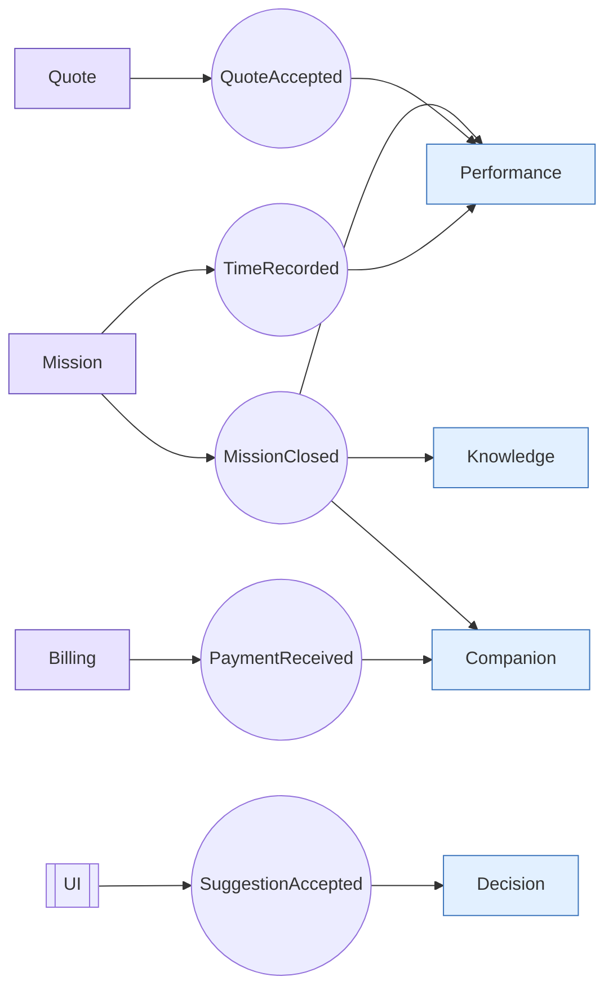

# Engine Events — Flux d'événements

> **Version** 1.0 — **Status** Frozen — **Owner** Architecture — **Last Update** 2026-08-02
> **Depends On:** [../events/README.md](../events/README.md), [ENGINE_INTERACTIONS.md](ENGINE_INTERACTIONS.md) — **Used By:** engines/ — **Niveau:** 2 · Architecture

## Objective
Décrire quels moteurs **publient** et **consomment** quels événements. Les événements sont le seul canal cœur → read-side (Loi 7/16), immuables et versionnés (Loi 4/17).

## Table publication / consommation (structurants)
| Événement | Publié par | Consommé par |
|---|---|---|
| `MissionCreated / StateChanged / Completed / Archived` | Mission | Companion, Performance, Knowledge |
| `InterventionAdded / Completed` | Mission | Decision, Performance |
| `SuggestionAccepted / Rejected` | UI → Decision | Decision (apprentissage) |
| `QuoteCreated / Sent / Accepted / Refused` | Quote | Performance, Companion, Billing |
| `InvoiceIssued / PaymentReceived / Overdue` | Billing | Performance, Companion |
| `TimeRecorded` | Mission | Performance |
| `KnowledgeCaptured / BestPracticeValidated` | Knowledge | Search, Sharing |
| `WarrantyExpiringSoon / MaintenanceDue` | Field Ops | Companion (alerte avant) |
| `ExtractionDone` | Quote Extraction | Mission (import) |
| `ResourcePublished / Imported` | Import/Export | — |
| `AuditRecorded` | tous (garde) | Audit |

## Event Graph (Mermaid)

Toutes les flèches vont **cœur → read-side** ; aucun retour (les moteurs read-side n'écrivent pas dans le cœur).

## Règles
Un événement porte `schema_version`. On apprend uniquement des actions **validées** (`*Accepted`, Loi 13). Aucun événement ne mute un agrégat cœur.

## Acceptance Criteria
Chaque événement structurant a son producteur et ses consommateurs ; aucun événement orphelin.

## Related Documents
[../events/README.md](../events/README.md) · [ENGINE_BOUNDARIES.md](ENGINE_BOUNDARIES.md)

## Next Reading
[ENGINE_BOUNDARIES.md](ENGINE_BOUNDARIES.md)

## Changelog
- 1.0 (2026-08-02) — Flux et graphe d'événements initiaux.
