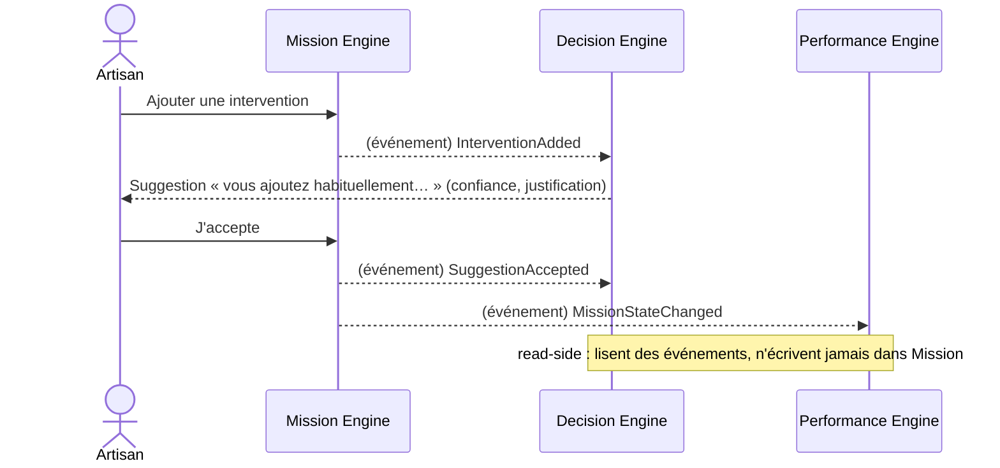

# Engine Interactions — Règles de communication

> **Version** 1.0 — **Status** Frozen — **Owner** Architecture — **Last Update** 2026-08-02
> **Depends On:** [ENGINE_DEPENDENCIES.md](ENGINE_DEPENDENCIES.md) — **Used By:** engines/, contracts — **Niveau:** 2 · Architecture

## Objective
Définir **comment** les moteurs communiquent. Objectif : cohésion forte, couplage faible, aucun accès sauvage.

## Les quatre modes autorisés
| Mode | Quand | Exemple |
|---|---|---|
| **Appel direct (service)** | uniquement **vers le bas** (cœur → référentiel/infra), même sens que les dépendances | Quote appelle Catalog pour résoudre un Article |
| **Contrat public** | capacité offerte par un moteur, décrite dans `contracts/` | Decision.suggest(context) |
| **Événement de domaine** | tout franchissement cœur → read-side, et toute réaction asynchrone | Mission publie `MissionClosed`, Performance écoute |
| **Read-model** | consultation d'une vue dérivée | Companion lit la synthèse d'attention |

## Règles absolues
1. **Jamais d'accès sauvage** aux tables/objets internes d'un autre moteur.
2. **Cœur → read-side : événement uniquement** (jamais d'appel direct ; Loi 7 — un moteur read-side ne modifie pas le cœur).
3. **Pas d'appel montant** (un moteur bas n'appelle jamais un moteur haut).
4. **Moteur ↔ moteur de même couche** : par événement/contrat, pas par appel croisé (Loi 16).
5. Un moteur **propose** ; c'est une **action utilisateur** (UI) qui écrit dans le cœur (Loi 7/18).

## Interaction Graph (Mermaid)

## Constraints
Toute interaction inter-moteur transite par un mode autorisé ci-dessus. Une interaction non décrite est interdite.

## Acceptance Criteria
Les quatre modes sont définis ; le sens (bas/événement) est explicite ; un exemple de bout en bout existe.

## Related Documents
[ENGINE_EVENTS.md](ENGINE_EVENTS.md) · [../contracts/README.md](../contracts/README.md)

## Next Reading
[ENGINE_EVENTS.md](ENGINE_EVENTS.md)

## Changelog
- 1.0 (2026-08-02) — Règles et graphe d'interaction initiaux.
