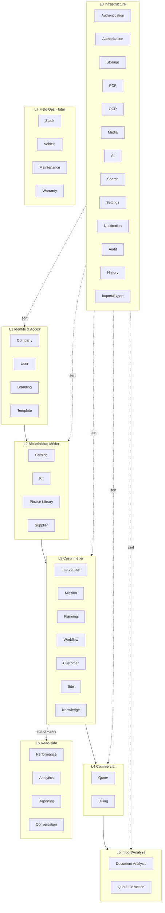
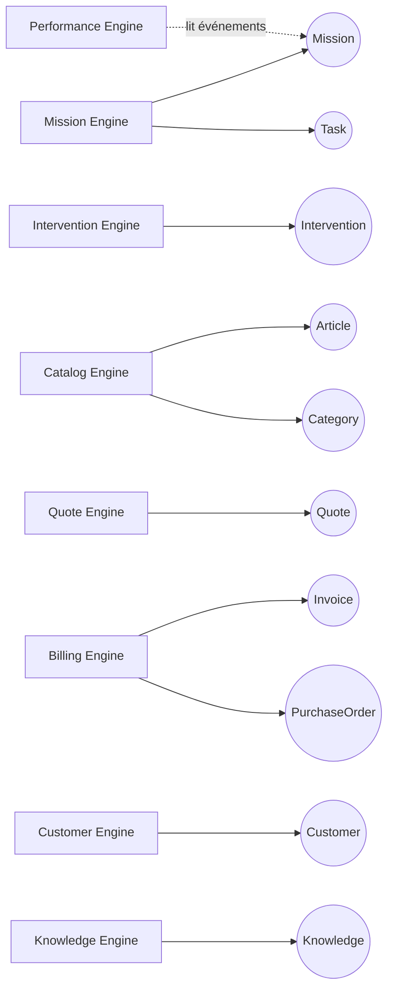

# Engine Map — Paysage des moteurs

> **Version** 1.0 — **Status** Frozen — **Owner** Architecture — **Last Update** 2026-08-02
> **Depends On:** [../domain/DOMAIN_MODEL.md](../domain/DOMAIN_MODEL.md) — **Used By:** engines/, dependencies, events — **Niveau:** 2 · Architecture

## Objective
Cartographier **tous** les moteurs, par couche architecturale, avec leur responsabilité unique, les objets qu'ils possèdent (Step 2), et le module existant correspondant. C'est la vue d'ensemble : un problème = un moteur.

## Couches
**L0 Infrastructure** (transverse, jamais métier) · **L1 Identité & Accès** · **L2 Référentiel (Bibliothèque Métier)** · **L3 Cœur métier** · **L4 Commercial** · **L5 Import/Analyse** · **L6 Read-side (Companion/Analytics)** · **L7 Field Ops (futur)**.

## Classification des 40 moteurs
| Moteur | Couche | Contexte / Objets possédés | Module existant |
|---|---|---|---|
| Authentication | L0 | émission/validation de session (aucun objet métier) | `auth`,`users` |
| Authorization | L0 | décision d'accès (Role) | `core/authorization` |
| Storage | L0 | octets (via clés) | `storage.py` |
| PDF | L0 | rendu d'un Document → PDF | `app/pdf` |
| OCR | L0 | image → texte (sous-partie d'analyse) | `document_analysis` |
| Media | L0 | Document · Photo · Attachment | *(nouveau)* |
| AI | L0 | fournisseur IA (enrichit, ne décide pas) | `app/ai` |
| Search | L0 | recherche transverse (read-model) | *(nouveau)* |
| Settings | L0 | configuration | `core/config` |
| Notification | L0 | Notification (livraison) | *(nouveau)* |
| Audit | L0 | Audit (trace sécurité, append-only) | *(nouveau)* |
| History | L0 | History (journal métier, append-only) | *(nouveau)* |
| Import / Export | L0/L5 | échange de données (copie) | *(nouveau)* |
| Company | L1 | **Company** | `branding`(Company) |
| User | L1 | **User** · Role | `users` |
| Branding | L1 | **Branding** | `branding` |
| Template | L1 | **Template** | `branding`(templates) |
| Catalog | L2 | **Article** · **Category** | `catalog` |
| Kit | L2 | **Kit** | *(nouveau)* |
| Phrase Library | L2 | **Phrase** | *(nouveau)* |
| Supplier | L2 | **Supplier** | *(nouveau)* |
| Intervention | L3 | **Intervention** | `interventions` *(créé)* |
| Mission | L3 | **Mission** · Task | *(nouveau)* |
| Planning | L3 | **Schedule** | *(nouveau)* |
| Workflow | L3 | **Workflow** | *(nouveau)* |
| Customer | L3 | **Customer** · Contact | `clients` |
| Site | L3 | **Site** · Building | `clients`(sites) |
| Knowledge | L3 | **Knowledge** | *(nouveau)* |
| Quote | L4 | **Quote** (+ QuoteCalculator) | `quotes` |
| Billing | L4 | **Invoice** · PurchaseOrder | *(nouveau)* |
| Document Analysis | L5 | analyse d'un document importé | `document_analysis`,`document_detection` |
| Quote Extraction | L5 | PDF → devis (ExtractedQuote) | `quote_extraction` *(créé)* |
| Performance | L6 | **Performance** (5 temps, écarts) | *(nouveau, read-side)* |
| Analytics | L6 | *(= famille Performance — voir anti-patterns)* | *(nouveau)* |
| Reporting | L6 | **Report** | *(nouveau)* |
| Conversation | L6 | **AIConversation** | *(nouveau)* |
| Stock | L7 | **Stock** · **Warehouse** | *(futur)* |
| Supplier *(cf. L2)* | — | *(le moteur Supplier est en L2)* | — |
| Vehicle | L7 | **Vehicle** | *(futur)* |
| Maintenance | L7 | **Maintenance** | *(futur)* |
| Warranty | L7 | **Warranty** | *(futur)* |

*(40 entrées ; « Analytics » et « Supplier(doublon) » sont signalés en [ENGINE_ANTI_PATTERNS.md](ENGINE_ANTI_PATTERNS.md) comme recouvrements à consolider.)*

## Engine Landscape (Mermaid)

## Ownership Graph (Mermaid)

## Constraints
Un objet = un seul moteur propriétaire (Loi 1). Un moteur L0 ne possède aucun objet métier. Un moteur *futur* (L7) est spécifié mais non construit tant qu'aucun consommateur réel n'existe (Loi 17).

## Acceptance Criteria
Les 40 moteurs sont classés, chacun avec responsabilité unique, objets possédés et module.

## Related Documents
[ENGINE_DEPENDENCIES.md](ENGINE_DEPENDENCIES.md) · [ENGINE_BOUNDARIES.md](ENGINE_BOUNDARIES.md) · [ENGINE_ANTI_PATTERNS.md](ENGINE_ANTI_PATTERNS.md)

## Next Reading
[ENGINE_DEPENDENCIES.md](ENGINE_DEPENDENCIES.md)

## Changelog
- 1.0 (2026-08-02) — Paysage initial des 40 moteurs.
