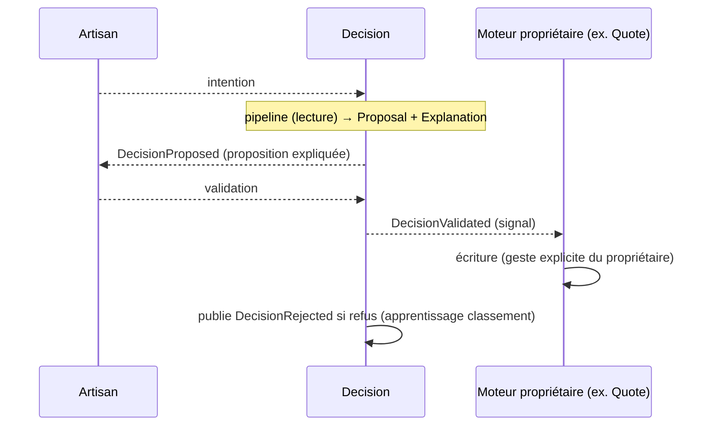

# Decision Events — Événements

> **Version** 1.0 — **Status** Validated — **Owner** Decision — **Last Update** 2026-08-02
> **Depends On:** [../ENGINE_EVENTS.md](../ENGINE_EVENTS.md) — **Used By:** Performance, AI — **Niveau:** 2 · Architecture

## Objective
Décrire les événements, en respectant le caractère **read-side** (il ne publie pas d'écriture du cœur).

## Événements consommés (lecture / apprentissage)
| Événement (source) | Réaction |
|---|---|
| une **intention** utilisateur (UI) | démarre le pipeline |
| `QuoteCreated` / `QuoteSent` (Quote) | apprend les préférences/usages (classement) |
| `MissionClosed` (Mission) | apprend des temps réels / résultats (classement) |
| `BestPracticeValidated` (Knowledge) | rafraîchit les candidats validés |

## Événements publiés (read-model, jamais d'écriture du cœur)
| Événement | Sens |
|---|---|
| `DecisionProposed` | une proposition + explication est prête (read-model) |
| `DecisionValidated` | l'utilisateur a validé → **le moteur propriétaire** exécute (Decision ne persiste pas) |
| `DecisionRejected` | refus/modif → signal d'apprentissage du **classement** |

> `DecisionValidated` **n'écrit pas** le cœur : c'est un signal ; l'écriture est faite par Quote/
> Workflow/Planning/etc. (moteurs propriétaires). Tout nouvel événement de cycle de vie = **ADR**.

## Flux

## Conformité
Consommés/publiés = read-side ; aucune écriture du cœur par Decision. ✅

## Changelog
- 1.0 (2026-08-02) — Événements initiaux.
