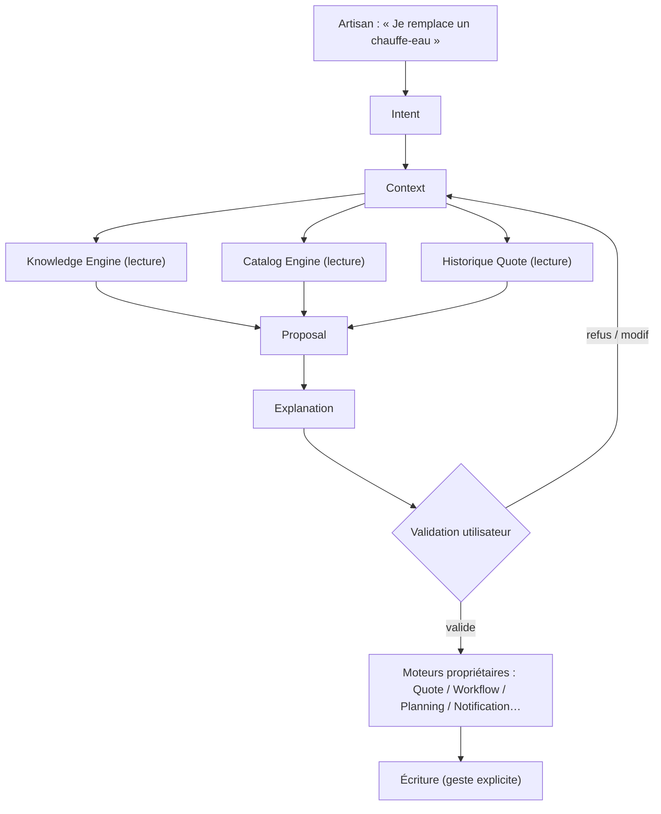

# Decision Graph — Graphe d'orchestration

> **Version** 1.0 — **Status** Validated — **Owner** Decision — **Last Update** 2026-08-02
> **Depends On:** [DECISION_OBJECTS.md](DECISION_OBJECTS.md) — **Used By:** DECISION_PIPELINE — **Niveau:** 2 · Architecture

## Objective
Montrer comment une intention mobilise (en **lecture**) les moteurs, jusqu'à une proposition validée par l'utilisateur.

## Graphe

## Lecture du graphe
- **En amont** (Intent → Proposal) : **lecture seule**, aucun effet de bord.
- **Barrière** : `Validation utilisateur` — rien ne s'écrit avant (Loi 7/18).
- **En aval** : l'**écriture** est faite par le **moteur propriétaire** (Decision ne persiste rien).

## Conformité
Read-side jusqu'à la validation ; écriture déléguée au propriétaire ; aucune décision automatique. ✅

## Changelog
- 1.0 (2026-08-02) — Graphe initial.
