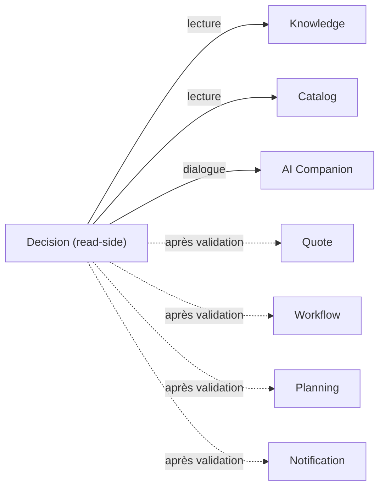

# Decision Integrations — Intégrations inter-moteurs

> **Version** 1.0 — **Status** Validated — **Owner** Decision — **Last Update** 2026-08-02
> **Depends On:** [../ENGINE_DEPENDENCIES.md](../ENGINE_DEPENDENCIES.md) — **Used By:** implémentation — **Niveau:** 2 · Architecture

## Objective
Décrire les interactions du cerveau avec les autres moteurs. **Documentaire** : ne remplace pas les
Contracts (STEP 5). **Lecture** en amont ; **écriture déléguée** au propriétaire en aval.

## Carte des intégrations
| Moteur | Sens | Interface |
|---|---|---|
| **Knowledge** | lecture | cartes/relations/confiance (source des propositions) |
| **Catalog** | lecture | articles/kits/catégories (lignes proposées) ; **aucun montant calculé** (ADR-023) |
| **Quote** | aval | sur validation → le Quote Engine **crée** le devis (geste explicite) |
| **Workflow** | aval | sur validation → déclenche le workflow |
| **Mission** | lecture + aval | contexte (historique) ; clôture proposée exécutée par Mission |
| **Planning** | aval | créneau/tâche proposés, posés par Planning |
| **Notification** | aval | relances/alertes émises par Notification |
| **Photo / Media** | lecture | photos de contexte ; **photos attendues** listées |
| **Document** | lecture + aval | pièces de contexte ; documents proposés générés par le propriétaire (ex. `app/pdf`) |
| **AI Companion** | dialogue | comprend l'intention, reformule, explique — **propose**, ne publie/décide jamais |

## Diagramme

## Règles
- **Amont = lecture** (Knowledge, Catalog, Mission, Photo, Document).
- **Aval = écriture par le propriétaire**, **après validation** (Quote, Workflow, Planning, Notification, Mission).
- Decision **n'écrit jamais** lui-même ; il **orchestre** et **explique**.

## Conformité
Interfaces documentaires ; read-side + délégation ; renvoie aux Contracts STEP 5. ✅

## Changelog
- 1.0 (2026-08-02) — Intégrations initiales.
