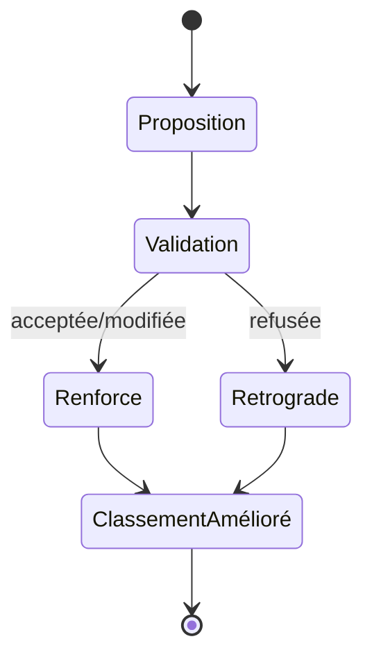

# Decision Learning — Apprentissage

> **Version** 1.0 — **Status** Validated — **Owner** Decision — **Last Update** 2026-08-02
> **Depends On:** [DECISION_SCORING.md](DECISION_SCORING.md), [../knowledge/KNOWLEDGE_LEARNING.md](../knowledge/KNOWLEDGE_LEARNING.md) — **Used By:** DECISION_PIPELINE — **Niveau:** 2 · Architecture

## Objective
Définir comment le moteur **améliore son classement** — **jamais les connaissances**.

## Règle d'or
Le Decision Engine apprend à **mieux classer/proposer**. Il **ne modifie jamais** une Knowledge Card :
le savoir appartient au **Knowledge Engine** et n'évolue que par **validation humaine**
([../knowledge/KNOWLEDGE_LEARNING.md](../knowledge/KNOWLEDGE_LEARNING.md)).

## Signaux d'apprentissage (lecture)
| Signal | Effet sur le **classement** |
|---|---|
| **Validations** utilisateur | renforce les candidats retenus |
| **Modifications** de la proposition | ajuste la sélection future |
| **Refus** | rétrograde les candidats écartés |
| **Temps réels** (MissionClosed) | affine durées/dimensionnement proposés |
| **Devis envoyés** | signale les combinaisons qui aboutissent |
| **Interventions réalisées / SAV** | corrige la pertinence |
| **Retours terrain validés** | (via Knowledge) rafraîchit les candidats validés |

## Boucle

## Frontières
- Apprend le **classement** (poids/préférences), **pas** le contenu des cartes.
- Toute évolution du **savoir** passe par le cycle Knowledge (Observation → Proposition → **Validation humaine**).
- Aucune modification silencieuse ; l'apprentissage reste **explicable** ([DECISION_EXPLAINABILITY.md](DECISION_EXPLAINABILITY.md)).

## Conformité
Améliore le classement, jamais le savoir ; validation humaine ; explicable (Loi 6/7/18). ✅

## Changelog
- 1.0 (2026-08-02) — Apprentissage initial.
