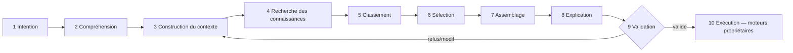

# Decision Pipeline — Pipeline décisionnel

> **Version** 1.0 — **Status** Validated — **Owner** Decision — **Last Update** 2026-08-02
> **Depends On:** [DECISION_ENGINE.md](DECISION_ENGINE.md), [DECISION_CONTEXT.md](DECISION_CONTEXT.md) — **Used By:** implémentation — **Niveau:** 2 · Architecture

## Objective
Décrire les **10 étapes** de l'intention à l'exécution.

## Pipeline

## Détail des étapes
| # | Étape | Entrée | Sortie | Effet de bord |
|---|---|---|---|---|
| 1 | Intention | phrase de l'artisan | intention brute | — |
| 2 | Compréhension | intention brute | `Intent` (verbe + cible) | — |
| 3 | Contexte | `Intent` + tenant | `Context` ([DECISION_CONTEXT.md](DECISION_CONTEXT.md)) | lecture |
| 4 | Recherche | `Context` | candidats (Knowledge/Catalog) | lecture |
| 5 | Classement | candidats | candidats scorés ([DECISION_SCORING.md](DECISION_SCORING.md)) | — |
| 6 | Sélection | scorés | retenus (règles — [DECISION_RULES.md](DECISION_RULES.md)) | — |
| 7 | Assemblage | retenus | `Proposal` (devis pré-rempli, kits, phrases, contrôles, photos attendues) | — |
| 8 | Explication | `Proposal` | `Explanation` ([DECISION_EXPLAINABILITY.md](DECISION_EXPLAINABILITY.md)) | — |
| 9 | **Validation** | `Proposal`+`Explanation` | décision **humaine** | **barrière** |
| 10 | Exécution | proposition validée | écriture par le **moteur propriétaire** | écriture (déléguée) |

## Invariants
- Étapes **1→8 = lecture pure**, aucune persistance.
- Étape **9 obligatoire** : rien ne s'écrit sans validation humaine (Loi 7/18).
- Étape **10** exécutée par le **propriétaire** (Quote crée le `Quote`, etc.), jamais par Decision.
- Aucun montant calculé (ADR-023) ; aucune invention (règles).

## Changelog
- 1.0 (2026-08-02) — Pipeline initial.
