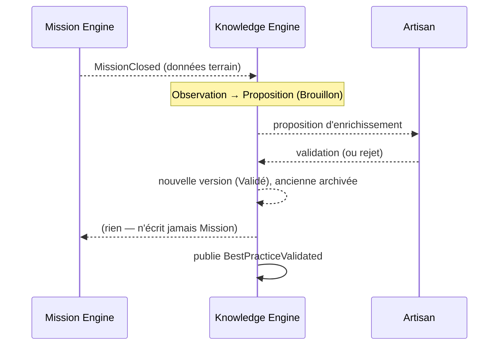

# Knowledge Events — Événements publiés & consommés

> **Version** 1.0 — **Status** Validated — **Owner** Knowledge — **Last Update** 2026-08-02
> **Depends On:** [../engines/Knowledge.md](../engines/Knowledge.md), [../ENGINE_EVENTS.md](../ENGINE_EVENTS.md) — **Used By:** Performance, IA, Notification — **Niveau:** 2 · Architecture

## Objective
Documenter les événements du moteur **tels que gelés**, sans en inventer.

## Événements publiés (gelés)
| Événement | Émis quand | Consommateurs typiques | Source |
|---|---|---|---|
| `KnowledgeCaptured` | une fiche est capturée (Brouillon créé) | Performance (métriques), IA (indexation lecture) | fiche objet `Knowledge` |
| `BestPracticeValidated` | une fiche passe **Validé** (validation humaine) | Performance, Notification, IA | fiche objet `Knowledge` |

> La fiche moteur note un **motif** `Knowledge*` (famille d'événements). Tout **nouvel** événement
> de cycle de vie (ex. versionnement, archivage) devrait être **confirmé par ADR** avant d'être
> considéré comme contractuel — non inventé ici (voir OPEN POINTS).

## Événement consommé (gelé)
| Événement | Réaction du moteur | Source |
|---|---|---|
| `MissionClosed` | déclenche l'**apprentissage** : le moteur *propose* un enrichissement/une fiche en **Brouillon** (jamais une modification directe) | fiche moteur |

## Flux (apprentissage déclenché par un événement)

## Règles (invariants gelés)
- Publication **append-only** ; un événement décrit un fait passé, immuable.
- La consommation de `MissionClosed` **ne modifie jamais** une fiche validée (voir LEARNING).
- Le moteur **n'écrit pas** l'émetteur (`Mission`).

## Conformité (STEP 1–8)
- Publiés/consommés = **exactement** ceux des fiches gelées. ✅
- Aucun événement inventé ; extensions renvoyées à un ADR. ✅

## Related Documents
[KNOWLEDGE_LEARNING.md](KNOWLEDGE_LEARNING.md) · [../ENGINE_EVENTS.md](../ENGINE_EVENTS.md)

## Next Reading
[KNOWLEDGE_APIS.md](KNOWLEDGE_APIS.md)

## Changelog
- 1.0 (2026-08-02) — Événements initiaux.
