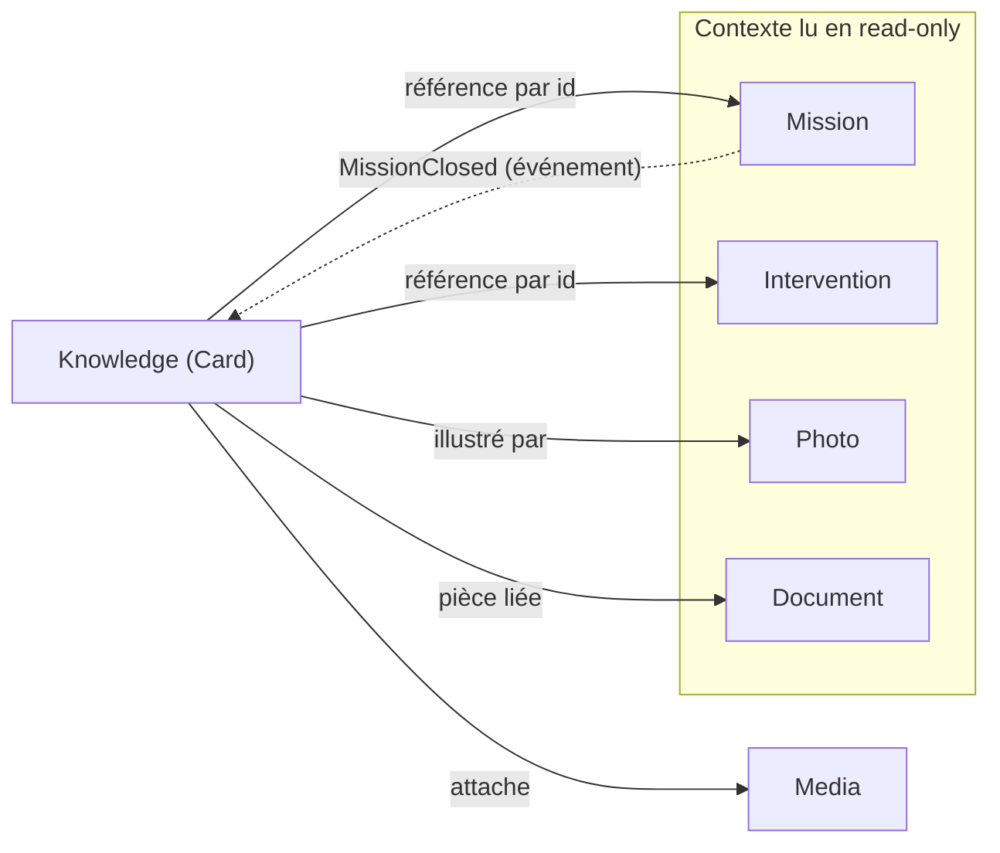

# Knowledge Graph — Graphe métier

> **Version** 1.0 — **Status** Validated — **Owner** Knowledge — **Last Update** 2026-08-02
> **Depends On:** [KNOWLEDGE_OBJECTS.md](KNOWLEDGE_OBJECTS.md) — **Used By:** KNOWLEDGE_VIEWS, IA — **Niveau:** 2 · Architecture

## Objective
Représenter les **relations entre objets déjà définis** pour faciliter navigation, découverte,
recherche et recommandations. **Ce graphe n'est PAS un second Domain Model** : le Domain Model
(STEP 2) reste l'unique source de vérité ; le graphe n'est qu'une **projection de lecture**.

## Graphe (objets existants uniquement)

## Lecture du graphe
- **Nœuds** = objets **existants** du Domain Model (aucun nœud inventé).
- **Arêtes pleines** = références **par id**, en lecture, portées par la Card `Knowledge`.
- **Arête pointillée** = **événement** (`MissionClosed`) déclenchant l'apprentissage (voir LEARNING).
- Le graphe ne stocke rien de plus que ce que `Knowledge` référence déjà : **zéro duplication**.

## Usages du graphe (lecture seule)
Navigation (de la Card vers sa mission/intervention/photos), découverte (fiches voisines par
contexte partagé), recherche (par objet lié), recommandation (fiches d'un même problème/équipement —
via facettes, voir [KNOWLEDGE_VIEWS.md](KNOWLEDGE_VIEWS.md)).

## Conformité (STEP 1–8)
- Tous les nœuds sont des objets gelés (STEP 2). ✅
- Toutes les arêtes existent déjà (relations/événements des fiches). ✅
- Graphe = projection, pas une source de vérité concurrente. ✅

## Related Documents
[KNOWLEDGE_RELATIONS.md](KNOWLEDGE_RELATIONS.md) · [KNOWLEDGE_VIEWS.md](KNOWLEDGE_VIEWS.md)

## Next Reading
[KNOWLEDGE_RELATIONS.md](KNOWLEDGE_RELATIONS.md)

## Changelog
- 1.0 (2026-08-02) — Graphe initial.
