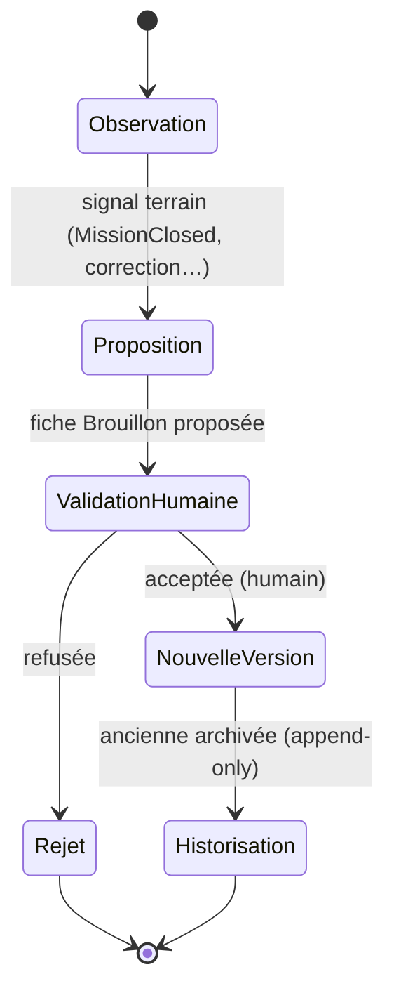

# Knowledge Learning — Apprentissage & IA

> **Version** 1.0 — **Status** Validated — **Owner** Knowledge — **Last Update** 2026-08-02
> **Depends On:** [KNOWLEDGE_EVENTS.md](KNOWLEDGE_EVENTS.md), [KNOWLEDGE_GOVERNANCE.md](KNOWLEDGE_GOVERNANCE.md) — **Used By:** IA, Performance — **Niveau:** 2 · Architecture

## Objective
Définir comment une Card **s'améliore** — **sans jamais** être modifiée silencieusement.

## Règle d'or
L'apprentissage **enrichit** le savoir ; il **ne modifie jamais automatiquement** une fiche validée.
Toute évolution suit obligatoirement le cycle ci-dessous (Loi 7/18 : l'artisan décide).

## Cycle obligatoire

## Sources d'observation (entrées, en lecture)
Temps réels, photos, retours SAV, garanties, diagnostics, corrections, commentaires, validations.
Toutes sont des **signaux** (souvent via `MissionClosed`) : elles alimentent une **proposition**,
jamais une écriture directe d'une Card validée.

## Étapes (détail)
| Étape | Qui | Effet |
|---|---|---|
| Observation | moteur (read-side) | capte un signal terrain |
| Proposition | moteur | crée une Card/version en **Brouillon** |
| Validation humaine | **artisan** | accepte (→ Validé) ou rejette |
| Nouvelle version | moteur | version validée ; publie `BestPracticeValidated` |
| Historisation | moteur | ancienne version **archivée** (Loi 5), historique conservé |

## IA — exploitation du moteur
L'IA (**AI Companion**) **n'invente jamais**. Elle se limite à : **naviguer**, **rechercher**,
**croiser**, **proposer**, **expliquer**, **justifier** — le tout en **lecture seule** sur les Cards.
- Toute réponse de l'IA est **traçable** jusqu'aux Cards `Knowledge` qui la fondent (id + version).
- Une suggestion IA est une **proposition** : elle entre dans le cycle ci-dessus (validation humaine),
  jamais une modification directe.
- L'IA ne fixe aucun prix/quantité/TVA au titre du Knowledge Engine (ADR-023 ; invariants IA).

## Conformité (STEP 1–8)
- Cycle = état gelé `Brouillon → Validé → Archivé` + append-only. ✅
- Aucune modification silencieuse ; validation humaine obligatoire (Loi 7/18). ✅
- IA lecture seule + traçable (invariants IA, Loi 6). ✅

## Related Documents
[KNOWLEDGE_EVENTS.md](KNOWLEDGE_EVENTS.md) · [KNOWLEDGE_METRICS.md](KNOWLEDGE_METRICS.md)

## Next Reading
[KNOWLEDGE_METRICS.md](KNOWLEDGE_METRICS.md)

## Changelog
- 1.0 (2026-08-02) — Apprentissage & IA initiaux.
