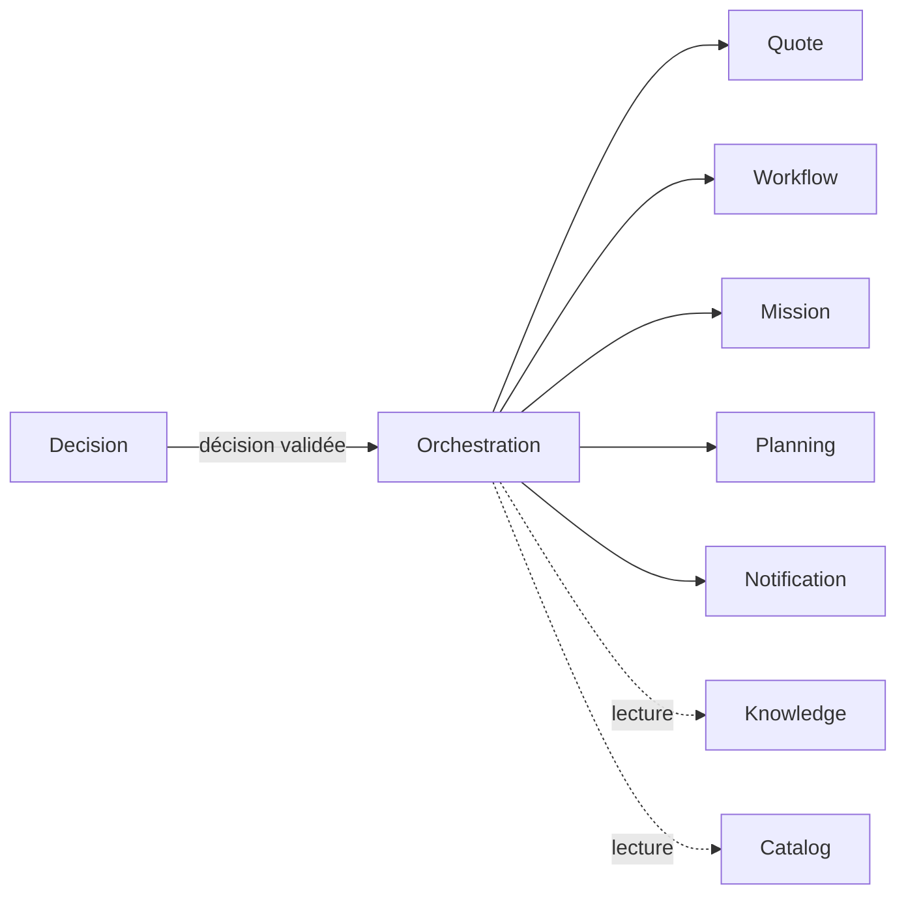

# Orchestration Integrations — Intégrations

> **Version** 1.0 — **Status** Validated — **Owner** Orchestration — **Last Update** 2026-08-02
> **Depends On:** [../ENGINE_DEPENDENCIES.md](../ENGINE_DEPENDENCIES.md) — **Used By:** implémentation — **Niveau:** 2 · Architecture

## Objective
Décrire les interactions du coordinateur. **Documentaire** : ne remplace pas les Contracts (STEP 5).
Chaque moteur **exécute ses écritures** ; Orchestration **déclenche et attend**.

## Carte des intégrations
| Moteur | Rôle dans l'orchestration |
|---|---|
| **Decision** | fournit la **décision validée** (déclencheur) — amont |
| **Quote** | crée le devis (étape) — propriétaire |
| **Workflow** | ouvre/avance un processus métier (étape) |
| **Mission** | crée/rattache/clôture une mission (étape) |
| **Planning** | pose/annule un créneau (étape + compensation) |
| **Notification** | informe client/artisan (étape) |
| **Knowledge** | **lecture** (contexte d'exécution si besoin) |
| **Catalog** | **lecture** (articles/kits pour une étape) — aucun montant calculé (ADR-023) |

## Diagramme

## Règles
- Orchestration **coordonne** ; les **écritures** appartiennent aux moteurs (Quote crée le `Quote`…).
- Échanges par **contrats/événements/tâches** (`app/tasks`), jamais par accès direct aux données d'autrui.
- Réutilise l'infrastructure existante (Redis/arq, journal `Event`/`History`) ; **aucun modèle dédié** (ADR sinon).

## Conformité
Interfaces documentaires ; coordination + délégation ; renvoie aux Contracts STEP 5. ✅

## Changelog
- 1.0 (2026-08-02) — Intégrations initiales.
