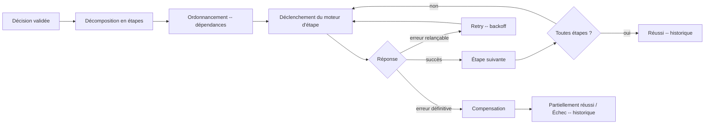

# Orchestration Pipeline — Pipeline d'exécution

> **Version** 1.0 — **Status** Validated — **Owner** Orchestration — **Last Update** 2026-08-02
> **Depends On:** [ORCHESTRATION_ENGINE.md](ORCHESTRATION_ENGINE.md), [ORCHESTRATION_STATES.md](ORCHESTRATION_STATES.md) — **Used By:** implémentation — **Niveau:** 2 · Architecture

## Objective
Décrire le déroulé d'une orchestration, de la décision validée à l'historique.

## Pipeline

## Étapes du pipeline
| # | Étape | Détail |
|---|---|---|
| 1 | Réception | décision **validée** uniquement (sinon rejet) |
| 2 | Décomposition | décision → étapes (1 étape = 1 moteur propriétaire) |
| 3 | Ordonnancement | respect des **dépendances** (ex. devis avant planification) |
| 4 | Déclenchement | appel/contrat/tâche vers le moteur (sync ou async — `app/tasks`) |
| 5 | Attente | collecte des résultats ; état **En attente** possible |
| 6 | Gestion d'erreur | [ORCHESTRATION_RETRY.md](ORCHESTRATION_RETRY.md) puis [ORCHESTRATION_COMPENSATION.md](ORCHESTRATION_COMPENSATION.md) |
| 7 | Clôture | état final + **historique** ([ORCHESTRATION_OBSERVABILITY.md](ORCHESTRATION_OBSERVABILITY.md)) |

## Invariants
- **Idempotence** : chaque étape peut être rejouée sans double effet (clé d'idempotence par étape).
- **Isolation des écritures** : chaque étape est exécutée par **son** moteur propriétaire.
- **Pas de montant** calculé (ADR-023) ; **pas de destruction** (Loi 5).

## Changelog
- 1.0 (2026-08-02) — Pipeline initial.
