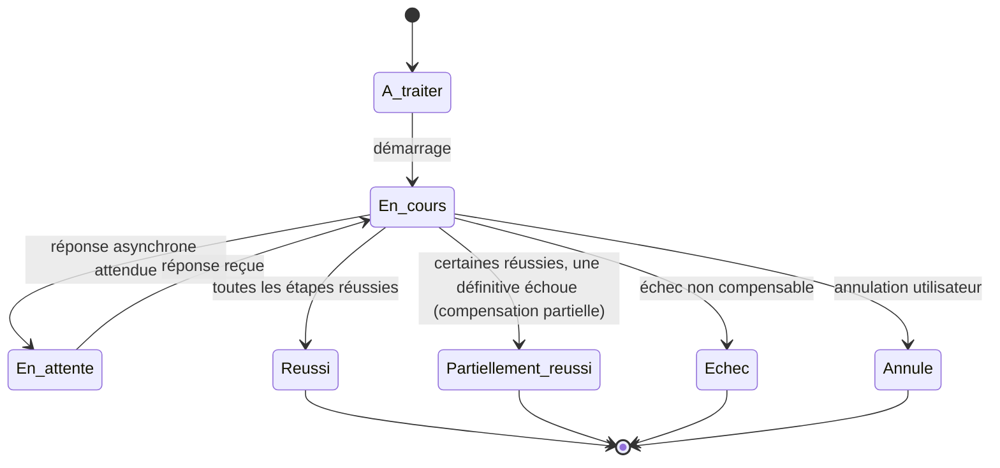

# Orchestration States — Cycle de vie

> **Version** 1.0 — **Status** Validated — **Owner** Orchestration — **Last Update** 2026-08-02
> **Depends On:** [ORCHESTRATION_PIPELINE.md](ORCHESTRATION_PIPELINE.md) — **Used By:** observabilité, tests — **Niveau:** 2 · Architecture

## Objective
Définir les états d'une orchestration (et de ses étapes).

## États d'une orchestration

## Signification
| État | Sens |
|---|---|
| **À traiter** | décision validée reçue, non démarrée |
| **En cours** | étapes en exécution |
| **En attente** | dépend d'une réponse externe/asynchrone |
| **Réussi** | toutes les étapes réussies |
| **Partiellement réussi** | certaines réussies ; échec définitif → compensation (bornée par les invariants des moteurs) |
| **Échec** | non aboutie, non compensable |
| **Annulé** | interrompue par l'utilisateur |

## États d'une étape
`À traiter → En cours → Réussi | Échec (relançable/définitif) | Compensée`.

## Règles
- Transitions **append-only** (chaque changement d'état est tracé — `Event`/`History`).
- **Partiellement réussi** est un état **de première classe** : certaines écritures (ex. devis
  `sent`) **ne se défont pas** (Loi 5) ; l'orchestration l'assume et le trace.

## Changelog
- 1.0 (2026-08-02) — États initiaux.
