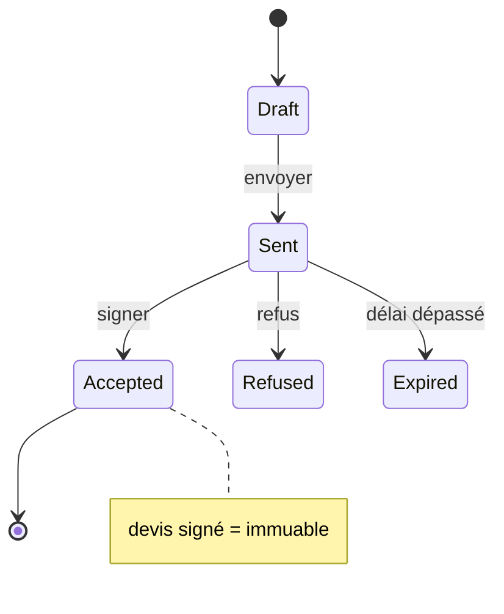
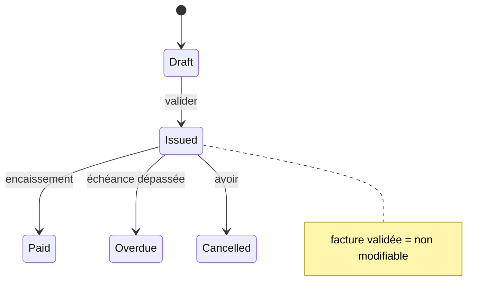

# Flow States — Machines à états canoniques

> **Version** 1.0 — **Status** Frozen — **Owner** Architecture — **Last Update** 2026-08-02
> **Depends On:** [../domain/OBJECT_LIFECYCLE.md](../domain/OBJECT_LIFECYCLE.md) — **Used By:** flows/ — **Niveau:** 2 · Architecture

## Objective
Les machines à états **de référence** (une seule source, Loi 1) réutilisées par les flux, en Mermaid. Les fiches de flux y renvoient plutôt que de les redéfinir.

## Mission
```mermaid
stateDiagram-v2
  [*] --> Prospect
  Prospect --> Visite --> Diagnostic --> Preparation --> Devis --> Validation
  Validation --> Commande --> Planification --> Intervention --> Controle
  Controle --> Facturation --> Paiement --> Garantie --> SAV --> Terminee
  Terminee --> [*]
  note right of Terminee : jamais de retour en brouillon (invariant)
```

## Quote (Devis)


## Invoice (Facture)


## PurchaseOrder
```mermaid
stateDiagram-v2
  [*] --> Draft --> Sent --> Confirmed --> Received --> Closed --> [*]
```

## Intervention (instance)
```mermaid
stateDiagram-v2
  [*] --> Planned --> InProgress --> Done --> Controlled --> [*]
```

## Constraints
Aucune transition n'est réversible si un invariant l'interdit (Devis signé, Facture validée, Mission terminée). Toute transition émet un événement ([FLOW_EVENTS.md](FLOW_EVENTS.md)).

## Acceptance Criteria
Les objets à états ont leur machine canonique unique.

## Related Documents
[../domain/OBJECT_LIFECYCLE.md](../domain/OBJECT_LIFECYCLE.md) · [FLOW_EVENTS.md](FLOW_EVENTS.md)

## Next Reading
[FLOW_EVENTS.md](FLOW_EVENTS.md)

## Changelog
- 1.0 (2026-08-02) — Machines à états canoniques.
