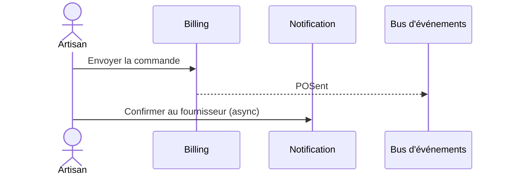

# Flow — Commander du matériel

> **Version** 1.0 — **Status** Frozen — **Owner** Architecture — **Last Update** 2026-08-02
> **Depends On:** [../FLOW_CATALOG.md](../FLOW_CATALOG.md) — **Used By:** implementation, ui — **Niveau:** 2 · Architecture · **Catégorie:** Achats

## Nom
Commander du matériel

## Mission
Envoyer la commande au fournisseur.

## Objectif métier
Envoyer la commande au fournisseur.

## Déclencheur
« Commander »

## Préconditions
Utilisateur authentifié ; tenant Company ; droits requis (voir FLOW_PERMISSIONS).

## Acteur principal
Artisan

## Acteurs secondaires
Fournisseur

## Objets concernés
PurchaseOrder

## Engines concernés
Billing

## Entrées
BC Draft

## Sorties
BC Sent

## Étapes détaillées
1. **Billing** — Envoyer la commande → événement `POSent` (contrôle : invariants ; résultat : étape validée).
2. **Notification** — Confirmer au fournisseur (async) (contrôle : invariants ; résultat : étape validée).

## Décisions & branches possibles
Confirmé → suivi livraison

## Diagramme de séquence

## États
Voir les machines canoniques : [../FLOW_STATES.md](../FLOW_STATES.md).

## Événements publiés
- `POSent`

## Événements consommés
—

## Permissions
Voir [../FLOW_PERMISSIONS.md](../FLOW_PERMISSIONS.md) (famille **Achats**). Action irréversible → confirmation explicite.

## Validation
Invariants du Domain Model (Step 2) vérifiés ; aucune donnée inventée ; le PDF/source fait foi le cas échéant.

## Erreurs possibles
Voir [../FLOW_ERRORS.md](../FLOW_ERRORS.md) : validation, permission (404 cross-tenant), conflit, ressource absente, échec IA/OCR/stockage/réseau.

## Rollback
Tant que l'objet est un brouillon : annulation directe. Après figement : compensation tracée (ex. avoir), jamais de destruction.

## Historisation
Chaque étape est journalisée (History, append-only — Loi 5).

## UX
Objectif clair ; **≤ 2 étapes** ; retour immédiat (progression, confirmation, annulation) ; langage artisan.

## Performance
Envoi asynchrone ; confirmation.

## Fin du processus
BC envoyé

## Critères de réussite
Commande transmise, non modifiable.

## Related Documents
[../FLOW_STATES.md](../FLOW_STATES.md) · [../FLOW_EVENTS.md](../FLOW_EVENTS.md) · [../FLOW_ERRORS.md](../FLOW_ERRORS.md) · [../FLOW_PERMISSIONS.md](../FLOW_PERMISSIONS.md)

## Next Reading
[../FLOW_CATALOG.md](../FLOW_CATALOG.md)

## Changelog
- 1.0 (2026-08-02) — Fiche de flux initiale.
