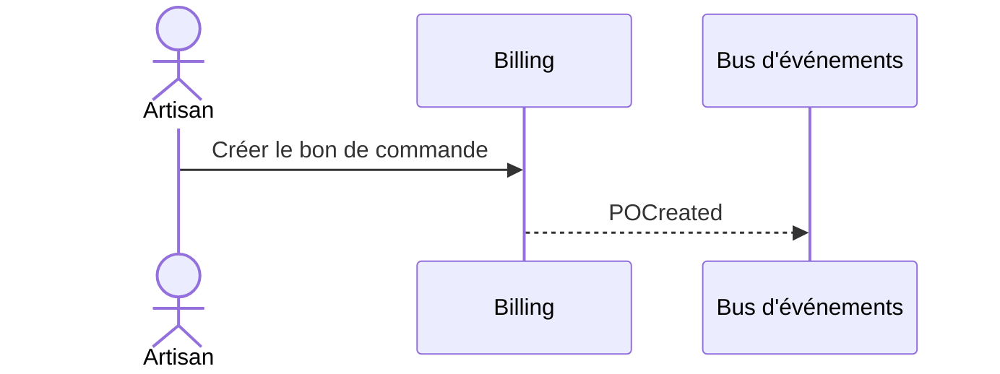

# Flow — Créer un bon de commande

> **Version** 1.0 — **Status** Frozen — **Owner** Architecture — **Last Update** 2026-08-02
> **Depends On:** [../FLOW_CATALOG.md](../FLOW_CATALOG.md) — **Used By:** implementation, ui — **Niveau:** 2 · Architecture · **Catégorie:** Achats

## Nom
Créer un bon de commande

## Mission
Préparer une commande fournisseur.

## Objectif métier
Préparer une commande fournisseur.

## Déclencheur
Besoin matériel

## Préconditions
Utilisateur authentifié ; tenant Company ; droits requis (voir FLOW_PERMISSIONS).

## Acteur principal
Artisan

## Acteurs secondaires
Fournisseur

## Objets concernés
PurchaseOrder

## Engines concernés
Billing, Supplier

## Entrées
Articles, fournisseur

## Sorties
BC Draft

## Étapes détaillées
1. **Billing** — Créer le bon de commande → événement `POCreated` (contrôle : invariants ; résultat : étape validée).

## Décisions & branches possibles
—

## Diagramme de séquence

## États
Voir les machines canoniques : [../FLOW_STATES.md](../FLOW_STATES.md).

## Événements publiés
- `POCreated`

## Événements consommés
—

## Permissions
Voir [../FLOW_PERMISSIONS.md](../FLOW_PERMISSIONS.md) (famille **Achats**). Action irréversible → confirmation explicite.

## Validation
Invariants du Domain Model (Step 2) vérifiés ; aucune donnée inventée ; le PDF/source fait foi le cas échéant.

## Erreurs possibles
Voir [../FLOW_ERRORS.md](../FLOW_ERRORS.md) : validation, permission (404 cross-tenant), conflit, ressource absente, échec IA/OCR/stockage/réseau.

## Rollback
Tant que l'objet est un brouillon : annulation directe. Après figement : compensation tracée (ex. avoir), jamais de destruction.

## Historisation
Chaque étape est journalisée (History, append-only — Loi 5).

## UX
Objectif clair ; **≤ 3 étapes** ; retour immédiat (progression, confirmation, annulation) ; langage artisan.

## Performance
Synchrone.

## Fin du processus
BC Draft

## Critères de réussite
Commande prête à envoyer.

## Related Documents
[../FLOW_STATES.md](../FLOW_STATES.md) · [../FLOW_EVENTS.md](../FLOW_EVENTS.md) · [../FLOW_ERRORS.md](../FLOW_ERRORS.md) · [../FLOW_PERMISSIONS.md](../FLOW_PERMISSIONS.md)

## Next Reading
[../FLOW_CATALOG.md](../FLOW_CATALOG.md)

## Changelog
- 1.0 (2026-08-02) — Fiche de flux initiale.
