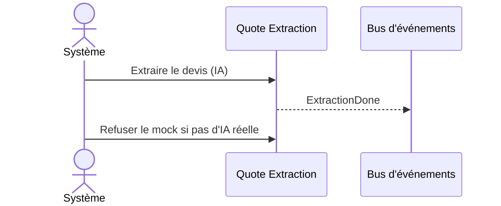

# Flow — Extraire un devis

> **Version** 1.0 — **Status** Frozen — **Owner** Architecture — **Last Update** 2026-08-02
> **Depends On:** [../FLOW_CATALOG.md](../FLOW_CATALOG.md) — **Used By:** implementation, ui — **Niveau:** 2 · Architecture · **Catégorie:** Devis

## Nom
Extraire un devis

## Mission
Reconstruire un devis complet depuis le PDF.

## Objectif métier
Reconstruire un devis complet depuis le PDF.

## Déclencheur
Après analyse

## Préconditions
Utilisateur authentifié ; tenant Company ; droits requis (voir FLOW_PERMISSIONS).

## Acteur principal
Système

## Acteurs secondaires
Artisan

## Objets concernés
ExtractedQuote

## Engines concernés
Quote Extraction, AI, Branding

## Entrées
Analyse

## Sorties
Devis éditable

## Étapes détaillées
1. **Quote Extraction** — Extraire le devis (IA) → événement `ExtractionDone` (contrôle : invariants ; résultat : étape validée).
2. **Quote Extraction** — Refuser le mock si pas d'IA réelle (contrôle : invariants ; résultat : étape validée).

## Décisions & branches possibles
Confiance faible → champs à vérifier

## Diagramme de séquence

## États
Voir les machines canoniques : [../FLOW_STATES.md](../FLOW_STATES.md).

## Événements publiés
- `ExtractionDone`

## Événements consommés
—

## Permissions
Voir [../FLOW_PERMISSIONS.md](../FLOW_PERMISSIONS.md) (famille **Devis**). Action irréversible → confirmation explicite.

## Validation
Invariants du Domain Model (Step 2) vérifiés ; aucune donnée inventée ; le PDF/source fait foi le cas échéant.

## Erreurs possibles
Voir [../FLOW_ERRORS.md](../FLOW_ERRORS.md) : validation, permission (404 cross-tenant), conflit, ressource absente, échec IA/OCR/stockage/réseau.

## Rollback
Tant que l'objet est un brouillon : annulation directe. Après figement : compensation tracée (ex. avoir), jamais de destruction.

## Historisation
Chaque étape est journalisée (History, append-only — Loi 5).

## UX
Objectif clair ; **≤ 3 étapes** ; retour immédiat (progression, confirmation, annulation) ; langage artisan.

## Performance
Extraction asynchrone ; jamais de donnée inventée.

## Fin du processus
Devis reconstruit et modifiable

## Critères de réussite
Le devis importé est reproduit, éditable.

## Related Documents
[../FLOW_STATES.md](../FLOW_STATES.md) · [../FLOW_EVENTS.md](../FLOW_EVENTS.md) · [../FLOW_ERRORS.md](../FLOW_ERRORS.md) · [../FLOW_PERMISSIONS.md](../FLOW_PERMISSIONS.md)

## Next Reading
[../FLOW_CATALOG.md](../FLOW_CATALOG.md)

## Changelog
- 1.0 (2026-08-02) — Fiche de flux initiale.
