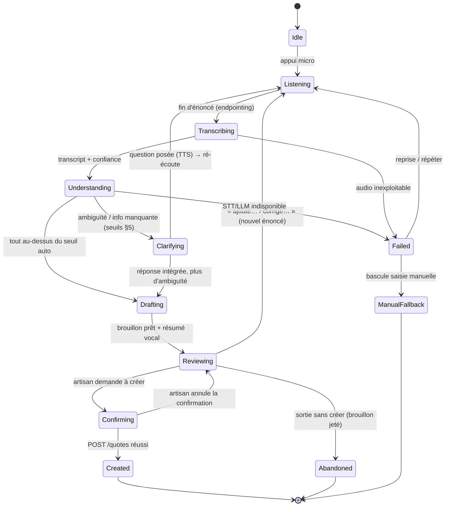
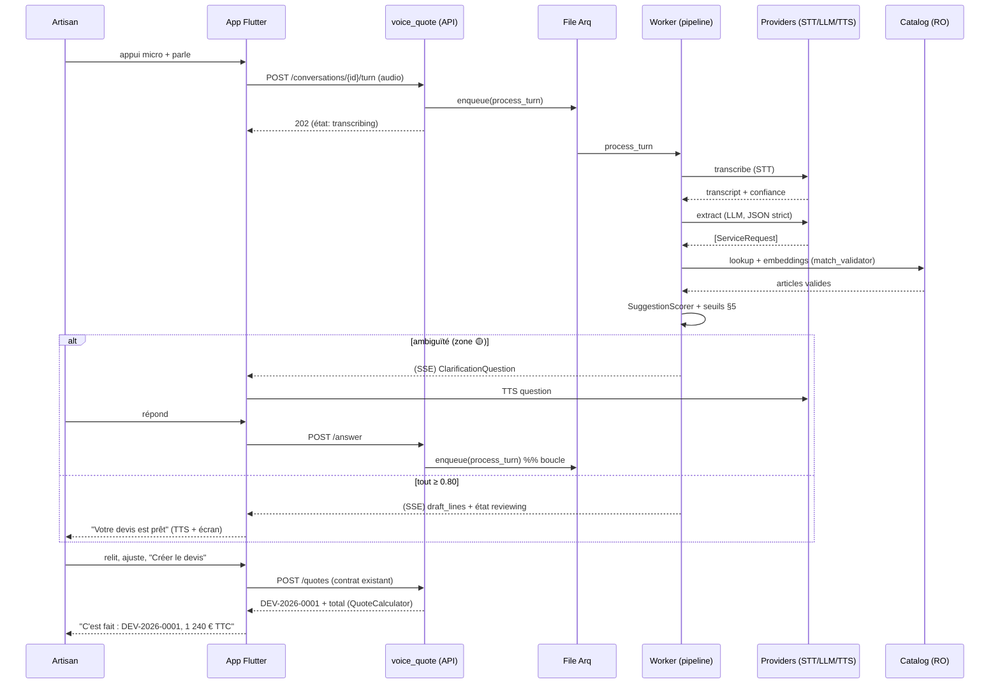

# V3.2 — Voice-to-Quote Engine — Blueprint fonctionnel

> **Statut : architecture à valider. Aucun code métier avant validation de ce Blueprint.**
> Ce document affine et étend [`03_IA_VOICE_TO_QUOTE.md`](03_IA_VOICE_TO_QUOTE.md) (vision one-shot) en
> un **moteur conversationnel** complet, et s'appuie sur les fondations livrées en V3.1
> ([`05_FONDATIONS_TECHNIQUES.md`](05_FONDATIONS_TECHNIQUES.md) : file de tâches Arq, Redis, worker,
> abstractions de fournisseur).

---

## 0. Positionnement — ce que ce moteur est, et n'est pas

> **L'objectif n'est pas la reconnaissance vocale. C'est de transformer une *conversation* en devis.**

La reconnaissance vocale (STT) n'est qu'**une brique d'entrée**. Le cœur du moteur est un
**orchestrateur de dialogue** : il écoute l'artisan décrire un chantier en langage naturel, comprend
les prestations, les rapproche du **catalogue réel de l'entreprise**, détecte ce qui manque ou est
ambigu, **pose les bonnes questions**, et n'aboutit qu'à un **brouillon** que l'artisan valide d'un
geste explicite. La différence avec un simple dictaphone :

| Dictaphone + STT | Voice-to-Quote Engine |
|---|---|
| Transcrit des mots | Comprend des **prestations** |
| Rend du texte | Rend un **devis structuré** (articles du catalogue + quantités) |
| Ne sait pas ce qu'il ignore | **Détecte l'ambiguïté** et demande |
| Monologue | **Dialogue** (questions/réponses vocales) |
| Aucune garantie | Respecte les **invariants produit** (aucun prix inventé, rien persisté sans validation) |

**Principe fondateur, non négociable (hérité V2, cf. CLAUDE.md §Invariants) :** l'IA *sélectionne* des
articles existants et *infère des quantités* (seule valeur numérique qu'elle produise). Elle **ne
choisit aucun prix, aucune TVA, ne modifie jamais le catalogue, ne crée jamais un devis.** La création
reste `POST /quotes`, seul endroit où un montant est calculé (`QuoteCalculator`).

---

## 1. Parcours utilisateur complet

### 1.1 Récit nominal — « Bonjour Monsieur… » → « Votre devis est prêt »

```
Contexte : Karim, plombier, est chez un client. Il ouvre Artizen, choisit le client
"M. Durand" (ou en crée un), et appuie sur le gros bouton micro.

① Karim  : « Alors… pour la salle de bain, je remplace le chauffe-eau par un ballon
            de 200 litres, je refais toute la robinetterie du lavabo et de la douche,
            et il faut reprendre deux mètres de saignée pour l'alimentation. »

② Artizen (écoute → transcrit → comprend → rapproche du catalogue → détecte un manque)

③ Artizen : 🔊 « J'ai noté : un chauffe-eau 200 L, un mitigeur lavabo, un mitigeur
            douche, et 2 mètres de saignée. Pour la robinetterie, vous êtes sur la
            gamme standard ou premium ? »

④ Karim  : « Standard, c'est bien. »

⑤ Artizen : 🔊 « Parfait. Petite précision : combien de points d'eau pour le
            chauffe-eau, un seul ? »

⑥ Karim  : « Oui, un seul. »

⑦ Artizen (construit le brouillon, calcule les quantités bornées, score de confiance)
          Affiche à l'écran la liste :
            • Chauffe-eau 200 L ...................... 1     [confiance 0.92]
            • Mitigeur lavabo standard ............... 1     [confiance 0.88]
            • Mitigeur douche standard ............... 1     [confiance 0.85]
            • Saignée mur (ml) ...................... 2     [confiance 0.79 ⚠ à relire]
          🔊 « Votre devis est prêt : 4 lignes. Je vous l'affiche, vérifiez les
              quantités et appuyez sur *Créer le devis* quand c'est bon. »

⑧ Karim  : relit, ajuste la saignée à 2,5 m d'un geste, appuie sur « Créer le devis ».

⑨ Artizen : POST /quotes → QuoteCalculator calcule les montants → DEV-2026-0001 créé.
          🔊 « C'est fait : devis DEV-2026-0001, 1 240 € TTC. Je prépare l'email au
              client ? »
```

**Ce qui est resté vrai à chaque instant :** aucun prix prononcé par l'IA (les montants
n'apparaissent qu'à l'étape ⑨, calculés par le backend) ; aucune ligne créée sans que Karim n'appuie
sur « Créer le devis » ; chaque ligne rattachée à un vrai article du catalogue ; chaque incertitude
soit résolue par une question (③⑤), soit signalée à l'écran (⑦, « à relire »).

### 1.2 Parcours alternatifs (à concevoir dès le départ)

| Cas | Comportement attendu |
|---|---|
| **Ambiguïté forte** (« la robinetterie » sans gamme) | Question ciblée (③), le dialogue continue. |
| **Information manquante** (quantité absente) | Défaut = 1, **signalé** « à relire », ou question si l'article est cher/critique. |
| **Prestation hors catalogue** (« je pose une pompe à chaleur » alors qu'aucun article n'existe) | Ne rien inventer : signaler « je n'ai pas d'article pour *pompe à chaleur*, ajoutez-le au catalogue ou saisissez la ligne à la main ». |
| **Audio inexploitable** (bruit, coupure) | « Je n'ai pas bien entendu, pouvez-vous répéter la dernière partie ? » (re-capture partielle). |
| **STT/LLM indisponible** (pas de clé, panne) | Dégradation : saisie texte de l'assistant V2 (`quote_assistant`), puis saisie 100 % manuelle. **L'app reste utilisable.** |
| **Hors ligne** | Capture audio mise en file locale + STT embarqué si dispo, sinon saisie manuelle (cf. §9). |
| **Abandon** | La conversation est un brouillon jetable : rien n'est persisté côté devis tant que `POST /quotes` n'est pas appelé. |

---

## 2. Pipeline IA — découpage détaillé

Chaque étape est **asynchrone** (worker Arq — fondation V3.1) et **un état observable** de la
conversation : l'UI affiche où on en est, et une étape qui échoue ne perd pas les précédentes.

```
        ┌─────────────────────────── boucle de dialogue ───────────────────────────┐
        │                                                                           │
 [1] Capture audio ─► [2] STT ─► [3] Nettoyage ─► [4] Segmentation ─► [5] Extraction
   (mobile/web,          (audio →     (ponctuation,     (tours /          d'intentions
    chunké → storage)    transcript   normalisation     énoncés)          (LLM, JSON strict)
                         + segments    métier)                                  │
                         horodatés,                                             ▼
                         confiance)                                    [6] Extraction des
                                                                          prestations
                                                                        {description, qté?,
                                                                         unité?, pièce?, span}
                                                                               │
     [12] Construction ◄─ [11] Questions ◄─ [10] Détection ◄─ [9] Calcul ◄─ [8] Correspondance
       du brouillon         complémentaires    d'ambiguïtés     quantités     catalogue
       (draft lines +        (si confiance      (seuils §5)     (bornées,     (RÉUTILISE
        variantes)           médiane → TTS      │               défaut 1)     match_validator
             │               question, écoute)  └── si résolu ──┘             + embeddings)
             ▼                     ▲                                                 │
     [13] Résumé vocal ────────────┘  (la question relance la boucle à [1])         │
             │                                                                       │
             ▼                                              ◄────────────────────────┘
     [14] Revue artisan (UI éditable) ─► [15] Validation explicite ─► [16] POST /quotes
                                                                        (QuoteCalculator)
                                                                              │
                                                                              ▼
                                                                    [17] Post-devis :
                                                                    brouillon d'email (LLM)
```

**Notes de conception par étape**

- **[2] STT** — via `SttProvider` (nouvelle abstraction, §8). Sortie = transcript + segments
  horodatés + **score de confiance STT** par segment. Biais de vocabulaire métier bâtiment
  (« placo », « VMC », « saignée », « chauffe-eau »).
- **[3] Nettoyage** — reponctuation, normalisation des nombres (« deux mètres » → `2 m`), suppression
  des hésitations. Déterministe autant que possible (pas de LLM si évitable).
- **[4] Segmentation** — découpe la transcription en **énoncés** rattachables à des prestations
  distinctes. Alimente les *tours de parole* (§3).
- **[5]/[6] Extraction** — LLM à **sortie structurée contrainte** (même principe que `CatalogMatcherClaude`
  en V2). Produit une liste d'**intentions de prestation** ancrées au vocabulaire du catalogue injecté
  dans le prompt.
- **[8] Correspondance** — **réutilise `match_validator.py` tel quel** (existe / bonne entreprise /
  actif / non-doublon, 4 raisons de rejet). Amélioration V3 : recherche **sémantique** (embeddings +
  pgvector) pour « je change le ballon » → « Chauffe-eau 200 L » sans correspondance lexicale.
- **[9] Quantités** — inférées puis **bornées par le schéma** (`RawSuggestionItem.quantity`, `gt=0
  max_digits=10`). Absente → défaut 1 signalé.
- **[10]/[11] Ambiguïté & questions** — le cœur conversationnel : selon les seuils (§5), soit on
  inclut, soit on **pose une question** (TTS) et on ré-écoute, soit on omet en signalant.
- **[12] Brouillon** — `SuggestionScorer` (V2, réutilisé) calcule la confiance finale. Variantes
  éco/standard/premium **uniquement à partir d'articles du catalogue**.
- **[16] Création** — le **seul** geste qui persiste : `POST /quotes`, déclenché par l'artisan.

---

## 3. Objets métier

Tous les objets demandés, avec leur **rattachement au code existant** (réutilisé) ou leur statut
(nouveau). Les schémas Pydantic détaillés sont en §12.

| Objet | Rôle | Origine |
|---|---|---|
| **Conversation** | Agrégat d'une session voix→devis : contexte (client, entreprise), état, tours, brouillon en cours, traces. | **Nouveau** (`voice_quote`) |
| **Tour de parole (Turn)** | Un énoncé, artisan (`user`) ou assistant (`assistant`), horodaté, avec transcript + confiance STT (côté user) ou intention (côté assistant). | **Nouveau** |
| **Intention (Intent)** | Ce que l'artisan veut faire : `add_service`, `set_quantity`, `choose_variant`, `answer_question`, `confirm`, `cancel`. Extraite par le LLM. | **Nouveau** |
| **Prestation (ServiceRequest)** | Une prestation exprimée : `{description, quantity?, unit?, room?, raw_span, stt_confidence}`. Résultat de l'extraction NLU, **avant** rapprochement catalogue. | **Nouveau** |
| **Article catalogue (CatalogItem)** | La vérité prix/unité/TVA. **Lecture seule** pour l'IA. | **Existant** (`catalog`) |
| **Suggestion (DraftLine)** | Une prestation **rapprochée** d'un article réel : `{catalog_item_id, designation, quantity, reason, confidence, source_turn_id}`. | Étend `QuoteSuggestionItemRead` + `ValidatedItem` |
| **Question (ClarificationQuestion)** | Une question posée par l'IA : `{type, target, prompt_text, options?, blocks_line_id?}`. Types : gamme, quantité, pièce, choix d'article, confirmation. | **Nouveau** |
| **Validation** | Le geste explicite de l'artisan : édition du brouillon puis `POST /quotes`. **Jamais** automatique. | **Existant** (`quotes`) |
| **Historique (History)** | Journal ordonné des tours + décisions ; permet rejouer/expliquer la conversation. | **Nouveau** (`ai_turns` + `ai_decisions`) |
| **Confiance (Confidence)** | Score composite 0..1 (STT × NLU × matching − pénalités), calculé au seul endroit prévu (`SuggestionScorer`, étendu). | **Existant, étendu** |
| **Trace de décision (DecisionTrace)** | Pour chaque ligne proposée/omise : d'où elle vient, pourquoi elle est là (ou pas), le détail du score. Base de l'explicabilité (§11). | **Nouveau** (`ai_decisions`) |

---

## 4. Machine à états de la conversation

La conversation est un **automate explicite** (comme `QUOTE_TRANSITIONS` l'est pour les devis). Chaque
état est observable par l'UI ; les transitions sont les seules autorisées.



Règles clés :
- **`Created` est terminal et n'est atteignable que par `Confirming`**, lui-même déclenché par un geste
  explicite. Aucune transition automatique `Drafting → Created`.
- **`Failed` ne perd jamais l'état** : les suggestions déjà obtenues restent dans le brouillon ; on
  peut reprendre ou basculer manuel.
- **La boucle `Clarifying → Listening`** est le mécanisme de dialogue : autant de tours que nécessaire,
  bornés par un **plafond de questions** (§5) pour ne pas harceler l'artisan.

---

## 5. Seuils de confiance — politique de décision

### 5.1 Composition du score

La confiance d'une ligne proposée combine trois sources, au **seul** endroit prévu (`SuggestionScorer`,
étendu — pas de nouvelle arithmétique éparpillée) :

```
confidence(ligne) = f(  stt_confidence,      # qualité de la transcription du segment source
                        nlu_confidence,      # certitude d'extraction de la prestation (LLM)
                        match_confidence )   # qualité du rapprochement catalogue (lexical/sémantique)
                    − pénalités (doublon, etc.)   # logique SuggestionScorer existante
```

`SuggestionScorer.score(...)` part déjà de la confiance auto-déclarée du LLM, escomptée par le ratio
de validité et les doublons. On l'étend pour **multiplier** par `stt_confidence` et `match_confidence`
(0..1), en conservant `round(…, 2)` et le plancher à 0.

### 5.2 Les trois zones de décision

| Zone | Seuil (score final) | Comportement de l'IA |
|---|---|---|
| 🟢 **Décide seule** | **≥ 0.80** | Inclut la ligne dans le brouillon, silencieusement, marquée « à relire ». |
| 🟡 **Demande confirmation** | **0.50 – 0.79** | **Pose une question ciblée** (gamme, quantité, pièce…) OU inclut en `⚠ à relire` bien visible si une question serait redondante. |
| 🔴 **Refuse / omet** | **< 0.50** | N'inclut pas. **Signale** explicitement : « je n'ai pas compris *X* » ou « aucun article ne correspond à *X* ». Jamais d'invention. |

Seuils **par étape** (garde-fous en amont, avant même le score composite) :

| Signal | Seuil | Effet |
|---|---|---|
| `stt_confidence` d'un segment | < 0.60 | Re-capture partielle : « pouvez-vous répéter la partie sur… ? » |
| Aucun article catalogue au-dessus de | 0.45 (similarité) | Prestation classée « hors catalogue » → signalée, jamais forcée. |
| Quantité inférée | absente | Défaut 1 + `⚠ à relire` ; question si l'article est marqué « sensible » (coût élevé). |

### 5.3 Garde-fous du dialogue

- **Plafond de questions** : au plus **3 questions** par brouillon (au-delà, on livre le brouillon avec
  les incertitudes marquées « à relire » plutôt que d'épuiser l'artisan).
- **Une question à la fois** : jamais deux questions dans le même tour TTS.
- **Toujours livrable** : même à 0 réponse, la conversation aboutit à un brouillon (éventuellement
  vide + « je n'ai rien compris, saisissez à la main ») — l'app reste utilisable.

*Ces valeurs (0.80 / 0.50 / 3 questions) sont des **hypothèses de départ à calibrer** sur données
réelles ; elles vivent dans la configuration, pas en dur dans la logique.*

---

## 6. Garde-fous (invariants produit appliqués à l'IA)

Chaque invariant CLAUDE.md est associé à un **mécanisme technique** qui le rend vrai — pas seulement une
intention.

| Garde-fou | Mécanisme |
|---|---|
| **Ne jamais inventer un prix / une TVA / un montant** | Aucun champ prix/TVA nulle part dans les objets IA (comme `RawSuggestionItem` et `QuoteLineCreate` n'en ont pas). Les montants n'existent qu'après `POST /quotes` via `QuoteCalculator`. L'IA ne *voit* les prix qu'en lecture pour proposer des variantes, jamais pour les écrire. |
| **Ne jamais modifier le catalogue** | Le module `voice_quote` a un accès **lecture seule** au `catalog` (repository de lecture). Aucune route d'écriture catalogue accessible depuis le pipeline. |
| **Ne jamais créer un devis sans validation explicite** | Le pipeline produit un **brouillon en mémoire/`ai_*`**, jamais un `Quote`. La création reste `POST /quotes`, déclenchée par l'UI. Machine à états : `Created` inatteignable sans `Confirming`. |
| **Signaler toute information manquante** | Toute quantité absente, gamme non précisée, prestation hors catalogue → **explicite** (question ou marqueur « à relire »/« hors catalogue »), jamais comblée par une invention. |
| **Ne rien croire sur parole** | `match_validator.py` re-valide chaque article (existe/tenant/actif/doublon) même si le prompt restreignait déjà le LLM. Article invalide → écarté, journalisé, sans faire échouer le reste. |
| **Isolation tenant** | `company_id` toujours issu du JWT ; conversation et job scopés au tenant ; mismatch → 404 (jamais 403). |
| **Résister à l'injection par la voix** | La transcription est **donnée**, pas instruction : le prompt d'extraction traite le transcript comme du contenu à analyser, jamais comme des ordres. Sortie contrainte au schéma (pas d'appel d'outil arbitraire). Liste d'articles plafonnée (anti-amplification, comme `RawSuggestionResponse.max_length=50`). |

---

## 7. Protocole d'interaction vocale

Quand parler, écouter, résumer, questionner — un protocole de tour de parole explicite.

| Moment | L'IA… | Déclencheur |
|---|---|---|
| **Écoute** | capture l'audio, transcription live à l'écran | appui micro / après avoir posé une question |
| **Fin d'écoute** | arrête la capture | *endpointing* (silence > seuil) OU relâchement du bouton (mode push-to-talk) |
| **Résume** | reformule ce qu'elle a compris avant de trancher | après un énoncé riche (≥ 2 prestations) ou avant confirmation finale |
| **Questionne** | pose **une** question ciblée (TTS) puis réécoute | ambiguïté en zone 🟡 (§5), une seule à la fois, plafond 3 |
| **Annonce** | « Votre devis est prêt », lit le nombre de lignes | brouillon complet (état `Reviewing`) |
| **Confirme** | énonce numéro + total **calculés par le backend** | après `POST /quotes` réussi |

Exigences :
- **Barge-in** : l'artisan peut couper la parole de l'IA (chantier bruyant, pressé) → l'IA s'arrête et
  écoute. Le TTS n'est jamais bloquant.
- **Deux modes de capture** : *push-to-talk* (appui maintenu — robuste au bruit) et *mains libres*
  (endpointing automatique). Choix selon contexte/préférence.
- **Feedback permanent** : transcription live + indicateur d'état (écoute / réflexion / question) pour
  que l'artisan sache toujours qui a la parole.
- **TTS optionnel** : tout le parcours doit rester faisable **en silencieux** (lecture écran + saisie),
  pour un chantier où parler à voix haute n'est pas discret. Le vocal est un accélérateur, pas une
  obligation.

---

## 8. Abstractions de fournisseur — aucun moteur imposé

On étend le pattern V2 (`AIProvider` + `ai/factory.py` + fallback mock). **Quatre** abstractions, toutes
derrière la factory, toutes avec un **mock déterministe hors ligne** (l'app démarre sans aucune clé).

```
                         ai/factory.py  (sélection par config, fallback mock)
   ┌───────────────┬───────────────────┬────────────────────┬─────────────────────┐
   ▼               ▼                   ▼                    ▼                     ▼
SttProvider    LlmProvider         TtsProvider        EmbeddingProvider     (existant)
transcribe()   complete()          synthesize()       embed()               AIProvider
audio→texte    (déjà en V2 :       texte→audio        texte→vecteur         = LlmProvider
+ confiance    extraction,                            (matching sémantique,   aujourd'hui
+ segments     variantes, email)                       pgvector)
```

| Abstraction | Rôle | Implémentations possibles (aucune imposée) | Mock |
|---|---|---|---|
| **`SttProvider`** | audio → transcript + segments + confiance | Whisper (OpenAI / **whisper.cpp local**), Deepgram, Google STT, Azure | transcript figé |
| **`LlmProvider`** | extraction, variantes, email (déjà `AIProvider`) | Claude *(intégré)*, GPT, Mistral, **Llama local** | réponses figées |
| **`TtsProvider`** | texte → audio (questions, annonces) | ElevenLabs, OpenAI TTS, **Piper local**, Azure | silence / bip |
| **`EmbeddingProvider`** | texte → vecteur (matching sémantique) | OpenAI, Voyage, **modèle local**, stockés en **pgvector** | vecteur déterministe |

Sélection par variables d'environnement (`STT_PROVIDER`, `LLM_PROVIDER`, `TTS_PROVIDER`,
`EMBEDDING_PROVIDER`), sur le modèle de `DEFAULT_AI_PROVIDER`. **Changer de moteur = changer une
variable + redémarrer.** Aucun code appelant ne dépend d'un fournisseur concret — seulement de
l'interface. Une clé manquante n'est jamais une erreur : fallback mock automatique.

---

## 9. Mode hors ligne

Le chantier a souvent une connexion médiocre. Matrice de dégradation (l'invariant « l'app reste
utilisable » prime) :

| Capacité | En ligne | Hors ligne (idéal) | Hors ligne (minimal garanti) |
|---|---|---|---|
| Capture audio | ✅ streaming | ✅ **enregistrée localement**, mise en file | ✅ enregistrée localement |
| STT | ✅ cloud | ✅ **whisper.cpp embarqué** (device) | ⛔ → différé jusqu'au réseau |
| Extraction / matching | ✅ LLM cloud | ⚠ petit LLM local (option) | ⛔ → différé, OU saisie assistée V2 |
| Catalogue | ✅ | ✅ **cache local** du catalogue (lecture) | ✅ cache local |
| Création de devis | ✅ `POST /quotes` | ⏳ **file de synchro** (créé au retour réseau) | ✅ saisie manuelle → file de synchro |
| TTS | ✅ cloud | ✅ Piper local | ⚠ questions affichées à l'écran (silencieux) |

Principe : **capturer d'abord, traiter ensuite.** Hors ligne, l'audio + le contexte (client, catalogue
en cache) sont enfilés localement ; au retour du réseau, le pipeline s'exécute (worker Arq) et le
brouillon apparaît. La **création reste explicite** même en différé (jamais de devis auto-créé au
retour réseau). À défaut de tout STT, la **saisie manuelle** (déjà présente) reste le filet.

---

## 10. Multilingue

- **Le catalogue est déjà language-agnostic** : les articles sont des UUID + désignations libres. Le
  matching opère sur les désignations réelles de l'entreprise, quelle que soit la langue parlée.
- **Détection de langue** au niveau STT ; **locale par entreprise/utilisateur** (préférence) comme
  défaut.
- **Prompts localisés** (extraction, questions) et **voix TTS par locale**.
- **Priorité : français** (vocabulaire métier bâtiment FR d'abord), puis extension. L'architecture ne
  code jamais « français » en dur : la langue est un paramètre du pipeline, porté par la `Conversation`.
- **Cas mixte** (artisan bilingue, termes techniques dans une autre langue) : le matching sémantique
  (embeddings multilingues) absorbe une partie des écarts.

---

## 11. Traçabilité & explicabilité

**Exigence : chaque décision de l'IA doit pouvoir être expliquée.** Question de confiance (l'artisan
engage sa responsabilité sur le devis) et de RGPD (décision automatisée).

Pour **chaque ligne** proposée ou **omise**, on persiste une `DecisionTrace` (`ai_decisions`) reliant :

```
DecisionTrace {
  draft_line_id?           // null si la prestation a été omise
  source_turn_id           // quel tour de parole
  raw_span                 // le fragment exact du transcript ("un ballon de 200 litres")
  extracted_service        // la prestation extraite {description, quantity, unit, room}
  matched_catalog_item_id? // l'article retenu (ou null)
  match_method             // "lexical" | "semantic" | "none"
  confidence_breakdown     // {stt, nlu, match, penalties, final}
  decision                 // "included" | "asked" | "omitted"
  reason                   // ex. "hors catalogue", "doublon", "confiance < 0.50"
}
```

Dans l'UI : à côté de chaque ligne, un « **pourquoi ?** » ouvre : *« Vous avez dit “un ballon de 200
litres” → rapproché de “Chauffe-eau 200 L” (sémantique, confiance 0.92). Quantité 1 (défaut). »*
Et pour les omissions : *« Vous avez dit “pompe à chaleur” → aucun article correspondant, non ajouté. »*

Rétention : audio + transcript = **données personnelles** → durée limitée, chiffrement au repos,
suppression après traitement selon préférence entreprise (cf. §15 risques RGPD). Les traces de décision
(sans l'audio) peuvent survivre plus longtemps pour l'auditabilité.

---

## 12. Modèles de données

### 12.1 Persistance (nouvelles tables, aucune ne touche `quotes`)

```
ai_conversations
  id (uuid, pk)            company_id (fk)         user_id (fk)
  client_id (fk, nullable) locale (str)            status (enum: voir §4)
  created_at  updated_at   draft (jsonb)           question_count (int)

ai_turns
  id (uuid, pk)            conversation_id (fk)     role (enum: user|assistant)
  seq (int)                transcript (text)        audio_key (str, nullable)
  stt_confidence (float)   payload (jsonb)          created_at

ai_jobs                    (déjà prévu doc 03 — le traitement async d'un tour/pipeline)
  id  company_id  user_id  conversation_id (fk)
  type (voice_quote)       status (queued|transcribing|extracting|matching|ready|failed)
  audio_key  transcript  extracted (jsonb)  result (jsonb)  confidence (float)
  error (str)  timings (jsonb)  created_at  updated_at

ai_decisions               (traçabilité §11)
  id  conversation_id (fk)  draft_line_id (uuid, nullable)  source_turn_id (fk)
  raw_span (text)  extracted_service (jsonb)  matched_catalog_item_id (fk, nullable)
  match_method (str)  confidence_breakdown (jsonb)  decision (str)  reason (str)

catalog_items              (EXISTANT — ajout optionnel V3)
  + embedding (vector)     # pgvector, pour le matching sémantique — pas de nouvelle infra
```

**Rien dans `quotes` n'est créé par l'IA.** Le `draft` (jsonb) alimente le brouillon Flutter, puis
`POST /quotes`.

### 12.2 Schémas applicatifs (Pydantic — s'appuient sur l'existant)

```python
# Prestation extraite (avant catalogue) — NOUVEAU
class ServiceRequest(BaseModel):
    description: str = Field(min_length=1, max_length=500)
    quantity: Decimal | None = Field(default=None, gt=0, max_digits=10)
    unit: str | None = None
    room: str | None = None
    raw_span: str                       # fragment source (traçabilité)
    stt_confidence: float = Field(ge=0, le=1)

# Ligne de brouillon — ÉTEND QuoteSuggestionItemRead
class DraftLine(BaseModel):
    catalog_item_id: uuid.UUID
    designation: str
    quantity: Decimal                   # bornée, comme RawSuggestionItem
    reason: str
    confidence: float = Field(ge=0, le=1)
    source_turn_id: uuid.UUID
    needs_review: bool                  # zone 🟡 → "à relire"

# Question de clarification — NOUVEAU
class ClarificationQuestion(BaseModel):
    type: Literal["variant", "quantity", "room", "item_choice", "confirm"]
    prompt_text: str                    # ce que le TTS énonce
    target_service_index: int
    options: list[str] = []             # ex. ["standard", "premium"]

# Réponse du pipeline pour un tour — NOUVEAU (assemble le tout)
class ConversationTurnResult(BaseModel):
    state: str                          # état machine §4
    draft_lines: list[DraftLine]
    questions: list[ClarificationQuestion]   # au plus 1 (protocole §7)
    unresolved: list[str]               # prestations hors catalogue / non comprises
    overall_confidence: float
```

Le pont vers la création finale est **le contrat existant, inchangé** :
`DraftLine[] → QuoteCreate{ client_id, lines:[QuoteLineCreate{catalog_item_id, quantity}] }`.

---

## 13. Architecture logicielle

### 13.1 Un nouveau module vertical : `voice_quote`

Suivant le patron du monolithe modulaire (`models/schemas/repository/service/deps/router`). Il
**orchestre** des capacités existantes ; il ne les réimplémente pas.

```
        voice_quote  (orchestrateur du dialogue)
        ├── router.py     : POST /ai/voice-quote, GET /ai/conversations/{id}, .../answer, .../refine
        ├── service.py    : machine à états §4, boucle de dialogue, plafond de questions
        ├── pipeline.py   : étapes [2]→[12] enchaînées (tâches Arq)
        ├── schemas.py    : ServiceRequest, DraftLine, ClarificationQuestion, …
        ├── repository.py : ai_conversations / ai_turns / ai_decisions
        └── deps.py
                │  dépendances À SENS UNIQUE et justifiées (règle CLAUDE.md §Architecture)
                ▼
   ┌────────────┼───────────────┬─────────────────────┐
   ▼            ▼               ▼                     ▼
  ai/        quote_assistant   catalog (lecture)    users.deps
 (STT, LLM,  (match_validator,  vérité prix/unité    (auth, company_id)
  TTS, embed) SuggestionScorer   /TVA, embeddings)
              RÉUTILISÉS)
```

- **`voice_quote` ne dépend PAS de `quotes`.** Il produit un brouillon ; c'est le **client Flutter** qui
  appelle `POST /quotes`. Cela garde la création comme geste utilisateur et évite un couplage
  d'écriture. (Alternative écartée : faire appeler `quotes.service` par le pipeline — rejetée car elle
  rapprocherait la création automatique, contraire à l'invariant.)
- **Réutilisation, pas duplication** : `match_validator` et `SuggestionScorer` restent la seule logique
  de validation/score. `voice_quote` les *branche* sur l'extraction NLU.
- **Traitement async** : chaque étape lourde (STT, LLM) est une tâche **Arq** (fondation V3.1). Le
  `router` enfile (`enqueue`) et rend un `job_id`/`conversation_id` immédiat.
- **Temps réel** : l'UI suit l'avancement via **SSE ou WebSocket** (`GET /ai/conversations/{id}/stream`)
  — transcription live + changements d'état + questions.

### 13.2 API (toutes sous `/api`, JWT, tenant du token, 404 si mismatch)

| Endpoint | Rôle |
|---|---|
| `POST /ai/voice-quote` | démarre une conversation (client_id, locale) → `202` + `conversation_id` |
| `POST /ai/conversations/{id}/turn` | envoie un tour audio (chunké → storage) → enfile le pipeline |
| `GET  /ai/conversations/{id}` | état + brouillon + questions en cours |
| `GET  /ai/conversations/{id}/stream` | SSE/WebSocket : progression temps réel |
| `POST /ai/conversations/{id}/answer` | réponse à une `ClarificationQuestion` |
| `POST /ai/conversations/{id}/refine` | régénère variantes / ajuste |
| `GET  /ai/conversations/{id}/decisions` | traces d'explicabilité (§11) |

La **création** n'a **pas** de nouvel endpoint : c'est le `POST /quotes` existant, appelé par l'UI avec
le brouillon relu.

### 13.3 UI Flutter (feature `voice_quote`, miroir du module)

- Écran **« Parler »** : gros bouton micro (push-to-talk + mains libres), transcription live, barre de
  progression par étape, barge-in.
- **Revue** : liste `DraftLine` éditable (quantité, +/− article, variante), badge de confiance,
  « pourquoi ? » (trace), aperçu du devis, brouillon d'email.
- **Validation** : bouton « Créer le devis » (geste explicite) → `POST /quotes`.
- **Dégradé** : si l'IA échoue → bascule assistant texte V2 puis saisie manuelle. Design System V3.

---

## 14. Diagramme de séquence — conversation complète



---

## 15. Risques & mitigations

| Risque | Impact | Mitigation |
|---|---|---|
| **Article halluciné** par le LLM | Devis faux | `match_validator` (existe/tenant/actif) — écarté et tracé. Invariant V2 conservé. |
| **Prix inventé** | Rupture de confiance / juridique | Aucun champ prix côté IA ; montants uniquement via `QuoteCalculator` après `POST /quotes`. |
| **Erreur STT** (bruit chantier, accent) | Mauvaise extraction | Confiance STT par segment + re-capture < 0.60 ; vocabulaire métier ; push-to-talk. |
| **Quantité ambiguë** | Ligne fausse | Bornage schéma + défaut 1 **signalé** + question si article sensible. Relu par l'artisan. |
| **Injection de prompt par la voix** | Détournement | Transcript = donnée, pas instruction ; sortie contrainte au schéma ; liste plafonnée (50). |
| **Latence / coût** (STT + LLM) | UX lente, facture | Pipeline async + feedback live ; cible < 10 s ; cache des extractions ; `ai_jobs.timings` + budget/entreprise. |
| **Panne fournisseur** | Fonction indispo | Fallback mock + bascule manuelle ; multi-fournisseur via factory. |
| **RGPD** (audio = donnée perso, décision automatisée) | Conformité | Rétention limitée, chiffrement au repos, suppression après traitement ; **explicabilité** (§11) ; l'humain valide (pas de décision 100 % auto). |
| **Sur-automatisation** (l'artisan fait confiance à l'aveugle) | Devis erronés signés | Confiance visible, « à relire », validation explicite obligatoire, traçabilité. |
| **Dérive des seuils** | Trop/pas assez de questions | Seuils en config, calibrés sur données réelles ; télémétrie (taux de questions, corrections). |
| **Coût pgvector / embeddings** | Complexité | Optionnel, itération 2 ; démarrer en matching lexical (`match_validator`) seul. |

---

## 16. Choix technologiques possibles (aucun imposé)

| Brique | Options | Recommandation de départ | Justification |
|---|---|---|---|
| **STT** | Whisper (OpenAI), whisper.cpp (local), Deepgram, Google, Azure | **Whisper OpenAI** (cloud) + **whisper.cpp** (offline) | qualité FR, écosystème, option locale pour l'offline |
| **LLM** | Claude *(intégré V2)*, GPT, Mistral, Llama local | **Claude** (déjà branché) | extraction structurée fiable, déjà en prod |
| **TTS** | ElevenLabs, OpenAI TTS, Piper (local), Azure | **OpenAI TTS** + **Piper** (offline) | naturel + option locale |
| **Embeddings** | OpenAI, Voyage, local | **OpenAI** (itération 2) | matching sémantique ; stockés en **pgvector** (pas de nouvelle infra) |
| **Vector store** | **pgvector** (PostgreSQL) | **pgvector** | réutilise la base existante, aucune infra ajoutée |
| **Temps réel** | SSE, WebSocket | **SSE** d'abord | plus simple, suffisant pour progression ; WS si besoin de duplex audio live |
| **File de tâches** | **Arq** *(livré V3.1)* | **Arq** | déjà en place, async-natif |

Tous derrière les abstractions §8 → un changement de fournisseur ne touche aucun code appelant.

---

## 17. Estimation du sprint suivant (V3.3 — première implémentation)

Découpage en lots livrables, chacun testable en isolation (providers mock → déterministe). Effort en
**points relatifs** (référence : un lot ≈ quelques jours), à confirmer.

| Lot | Contenu | Dépend de | Effort |
|---|---|---|---|
| **L1 — Abstractions & mocks** | `SttProvider`, `TtsProvider`, `EmbeddingProvider` + mocks + factory + config | V3.1 | M |
| **L2 — Persistance** | tables `ai_conversations`/`ai_turns`/`ai_jobs`/`ai_decisions` + migration Alembic | L1 | S |
| **L3 — Pipeline étapes [2]→[9]** | STT→extraction→matching (branché sur `match_validator`/`SuggestionScorer`), tâches Arq | L1, L2 | L |
| **L4 — Moteur de dialogue** | machine à états §4, seuils §5, génération de questions, plafond, boucle | L3 | L |
| **L5 — API + temps réel** | endpoints §13.2 + SSE ; scoping tenant (404) | L4 | M |
| **L6 — UI « Parler » + Revue** | écran micro, transcription live, revue éditable, validation → `POST /quotes` | L5 | L |
| **L7 — Explicabilité** | `ai_decisions` + « pourquoi ? » dans l'UI | L4, L6 | M |
| **L8 — Matching sémantique** *(itération 2)* | embeddings + pgvector | L3 | M |
| **L9 — Offline / multilingue** *(itération 2)* | capture différée, cache catalogue, locale | L1–L6 | L |
| **Transverse** | tests déterministes (invariants : rien persisté, aucun montant inventé), télémétrie de seuils | tous | M |

**Chemin critique recommandé (MVP fonctionnel) :** L1 → L2 → L3 → L4 → L5 → L6, en **français, en
ligne, matching lexical**, un tour de dialogue puis multi-tours. L7 (explicabilité) dans la foulée. L8
(sémantique), L9 (offline/multilingue) en itération 2.

---

## 18. Critères de validation de ce Blueprint (definition of ready)

Avant tout développement, l'artisan-décideur valide :

1. Le **parcours §1** correspond à l'usage terrain (chantier, bruit, rapidité).
2. Les **seuils §5** (0.80 / 0.50 / plafond 3 questions) sont des points de départ acceptables.
3. Le **périmètre du MVP §17** (FR / en ligne / lexical) est le bon premier pas.
4. Les **garde-fous §6** sont jugés suffisants (aucun prix inventé, validation explicite, traçabilité).
5. Les **choix techno §16** de départ (Whisper, Claude, SSE, pgvector en it. 2) sont approuvés.

**Rien n'est codé tant que ce Blueprint n'est pas validé** — conformément à la consigne V3.2.
