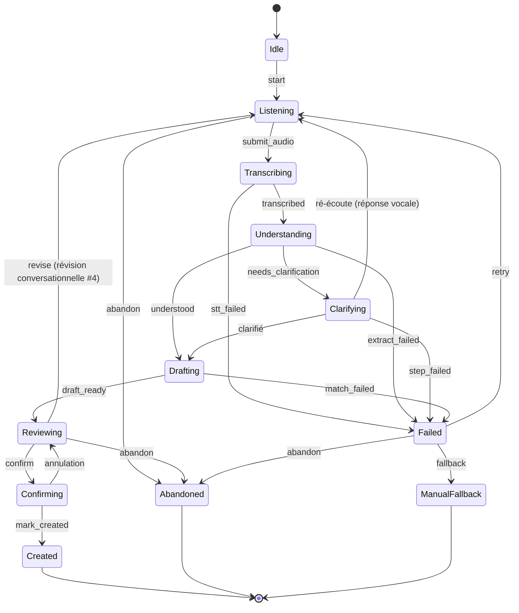
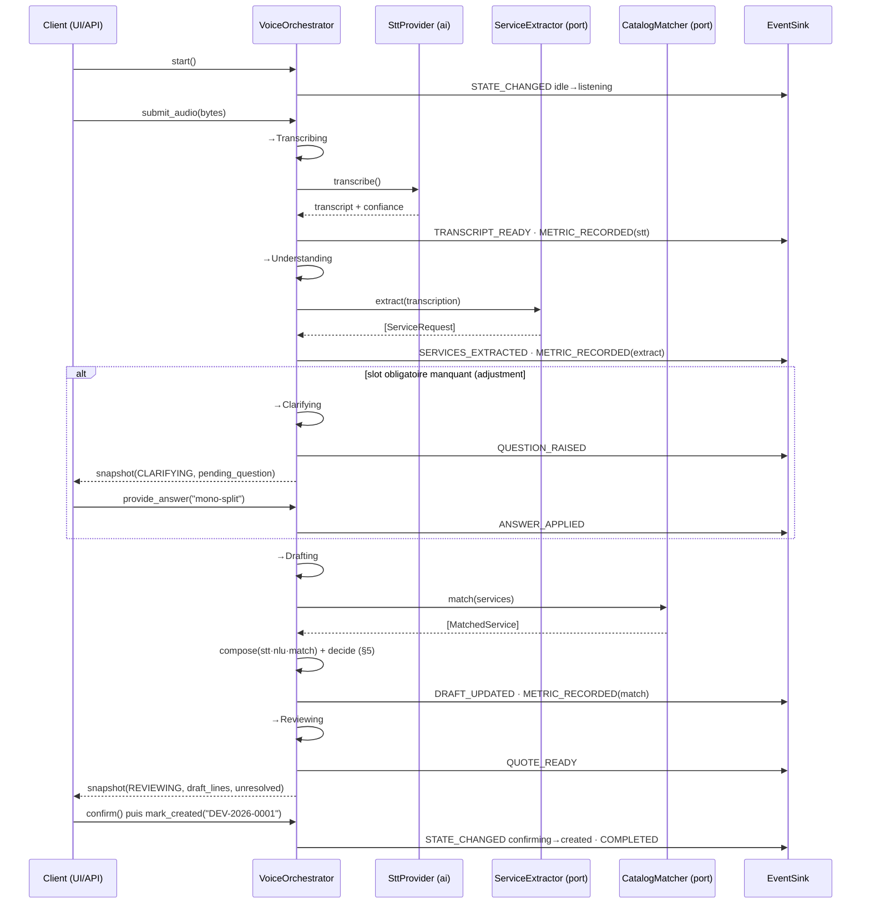

# V3.3 — Voice Orchestrator — Rapport d'architecture

> **Statut : ✅ livré (Sprint V3.3, avant la persistance).** Le moteur d'orchestration du pipeline
> Voice-to-Quote est en place, **sans aucune dépendance à la base métier**. La persistance des
> conversations IA n'est implémentée qu'**après** validation de cette orchestration, comme demandé.
> Zéro régression : **236 tests backend verts** (223 + 13 nouveaux).

Réalise la couche « moteur de dialogue » du [Blueprint §4/§5](06_VOICE_TO_QUOTE_BLUEPRINT.md), sur les
fondations async V3.1 et les abstractions de fournisseur L1.

---

## 1. Rôle et principe

Le Voice Orchestrator **pilote une conversation** de bout en bout : il possède la machine à états et le
flux de contrôle, **mais aucune étape**. STT et TTS viennent des abstractions `app.ai` ; l'extraction
(LLM) et la correspondance catalogue (base) sont des **ports injectés**. C'est ce qui garde le moteur
libre de la base métier et rend chaque étape testable isolément avec un faux.

> **Contrainte centrale tenue :** `app/voice_quote/` n'importe **que** `app.ai`, `app.core.config` et
> ses propres modules. Jamais `app.database`, `app.catalog`, `app.quotes`, `app.quote_assistant`, ni
> `sqlalchemy`. Cette frontière est **vérifiée par un test statique** (`ast`) qui échoue au moindre
> import interdit — elle ne peut pas dériver en silence.

---

## 2. Architecture logicielle

```
app/voice_quote/                     dépend de…
├── states.py        ConversationState + VOICE_TRANSITIONS + InvalidTransition   (pur)
├── schemas.py       ServiceRequest, MatchedService, DraftLine, Question,        (pur)
│                    UnresolvedItem, ConversationSnapshot
├── events.py        VoiceEvent (enveloppe normalisée) + EventType + EventSink   (pur)
├── metrics.py       StepMetrics (chrono par étape)                              (pur)
├── errors.py        classify() → StepFailure (recoverable ?)          → app.ai.exceptions
├── confidence.py    ConfidencePolicy (compose + decide, seuils config) → app.core.config
├── questions.py     MandatoryInfoQuestionStrategy (adjustment #2)               (pur)
├── ports.py         ServiceExtractor, CatalogMatcher (Protocols)     → app.ai.schemas
└── orchestrator.py  VoiceOrchestrator (le moteur)                    → app.ai.base, tout ci-dessus

        injecté au moteur, JAMAIS importé par lui :
        · SttProvider / TtsProvider   → app.ai (abstraction L1)
        · ServiceExtractor (LLM)      → adapter L3 (importera l'IA)
        · CatalogMatcher (catalogue)  → adapter L3 (importera quote_assistant + catalog repo)
```

**Une instance = une conversation.** L'état vit en mémoire dans l'instance. `snapshot()` en renvoie une
photographie sérialisable (`ConversationSnapshot`) — c'est exactement ce qu'un lot de persistance
mappera sur les tables `ai_conversations` / `ai_turns`, et ce qu'une API renverra. Le moteur ignore
tout de cette persistance.

**Pourquoi des ports plutôt qu'un appel direct ?** `CatalogMatcher` devra, en L3, réutiliser
`quote_assistant.MatchValidator` + le dépôt catalogue (base). Le déclarer comme `Protocol` et l'injecter
signifie que cette dépendance vit dans l'**adaptateur** (couche externe), pas dans le moteur — le moteur
reste pur, et chaque étape se teste avec un faux déterministe.

---

## 3. Diagramme d'états

Reflet exact de `VOICE_TRANSITIONS` (états ⇄ cibles autorisées ; toute transition absente lève
`InvalidTransition`).



Invariants garantis par la carte :
- **`Created` est terminal et n'est atteignable que par `Confirming`** — pas de raccourci
  `Drafting → Created` : un brouillon ne devient jamais un devis sans le geste explicite de confirmation.
- **`Failed` ne perd jamais le travail** : le brouillon construit est conservé ; on repart en
  `Listening` (retry) ou `ManualFallback`.
- **Poser une 2ᵉ question** ne change pas d'état (on reste `Clarifying`) : ce n'est pas une transition,
  donc pas de self-loop dans la carte — seule la question en attente change.

---

## 4. Diagramme de séquence — un tour avec clarification



En cas d'échec d'une étape, le chemin bascule vers `Failed` (voir §7) au lieu de continuer.

---

## 5. Événements normalisés

Chaque pas surface via la **même enveloppe** `VoiceEvent` : `type`, `conversation_id`, `sequence` (n°
croissant par conversation), `elapsed_ms` (depuis le début), `payload` JSON. Uniformité voulue : le
même flux alimente l'UI temps réel (SSE/WebSocket, plus tard), la persistance (plus tard) et les logs,
sans qu'aucun consommateur ne traite un cas particulier.

| `EventType` | Émis quand | Payload principal |
|---|---|---|
| `state_changed` | à chaque transition | `from_state`, `to_state`, `trigger` |
| `transcript_ready` | STT terminé | `text`, `confidence` |
| `services_extracted` | NLU terminé | `count` |
| `question_raised` | question posée | `question` |
| `answer_applied` | réponse intégrée | `slot`, `target` |
| `draft_updated` | brouillon (re)calculé | `line_count`, `unresolved_count`, `overall_confidence` |
| `quote_ready` | brouillon prêt à la revue | `line_count` |
| `completed` | devis créé (terminal) | `quote_reference`, `line_count` |
| `step_failed` | étape en échec | `step`, `error_code`, `message`, `recoverable` |
| `metric_recorded` | étape chronométrée | `step`, `duration_ms` |

Le moteur émet via un `EventSink` optionnel et **purement additif** : il **journalise toujours** en
interne, donc rien n'est perdu sans sink. Les tests branchent un `CollectingEventSink` pour vérifier le
flux exact.

---

## 6. Confiance : composition et décision (Blueprint §5)

Un seul endroit (`ConfidencePolicy`), comme `QuoteCalculator` pour l'argent :

- **Composition** : `confidence = round(clamp(stt · nlu · match), 2)`. Un **produit**, pas une moyenne :
  une ligne ne vaut que son maillon le plus faible — une correspondance parfaite sur une phrase mal
  entendue ne doit pas « moyenner » vers « confiant ».
- **Décision** (seuils lus en config, ajustement #1) :
  - `≥ VOICE_CONFIDENCE_AUTO (0.80)` → **incluse**, `needs_review=False` ;
  - `[0.50, 0.80)` → **incluse** mais `needs_review=True` (« à relire ») ;
  - `< VOICE_CONFIDENCE_CLARIFY (0.50)` → **omise**, versée dans `unresolved` avec sa raison. Jamais
    inventée.

Les **questions** (structure) et la **confiance** (fiabilité par ligne) sont deux mécanismes distincts :
les questions résolvent les **slots obligatoires manquants** (adjustment #2, pilotées par
l'information restante, pas par un plafond) ; la confiance décide ensuite du sort de chaque ligne
matchée.

---

## 7. Gestion centralisée des erreurs

Toute étape faillible passe par **un seul** wrapper, `_run_step` :

1. la chronomètre (même en cas d'échec) ;
2. sur exception : `classify()` la normalise en `StepFailure` (`error_code`, message, `recoverable`) —
   en inspectant les **types** d'exception, jamais leur texte, donc stable entre SDK ;
3. bascule en `Failed` **en conservant le brouillon**, émet `step_failed`, et **abandonne le tour**
   (signal interne `_PipelineAborted` capté à la frontière de la méthode publique).

`recoverable` distingue « le fournisseur a cligné, réessayez » (`AIProviderUnavailableError`, timeout →
`True`) de « cette entrée/logique ne peut pas aboutir » (`False`) — ce que l'UI traduit en *réessayer*
vs *basculer en manuel*. Aucune étape n'invente sa propre gestion d'échec ; un échec ne détruit jamais
la conversation (Blueprint §9).

---

## 8. Métriques & journalisation

- **Métriques** : `StepMetrics.measure(step)` enregistre la durée (ms) de chaque étape, exposée en
  `snapshot().timings_ms` — l'équivalent en mémoire de `ai_jobs.timings`. Un `metric_recorded` est émis
  par étape réussie.
- **Journalisation** : chaque **transition** (`voice.transition … from → to trigger=…`) et chaque
  **échec** (`voice.step_failed … code=… recoverable=…`) est journalisé avec le `conversation_id`, via
  le logging centralisé du projet.

---

## 9. Couverture de tests

`app/tests/test_voice_orchestrator.py` — **13 tests, déterministes, sans base ni réseau** (faux injectés
via les ports, mocks STT/TTS L1) :

| Test | Prouve |
|---|---|
| `created_is_terminal_and_only_reached_from_confirming` | l'invariant clé de la carte d'états |
| `nominal_flow_reaches_reviewing_then_created` | flux complet start→…→created + timings présents |
| `missing_mandatory_slot_triggers_a_question_then_resolves` | clarification puis résolution (#2) |
| `questions_stop_when_no_mandatory_slot_remains_not_at_a_fixed_cap` | arrêt piloté par l'info, pas un plafond |
| `confidence_bands_include_review_and_omit` | les 3 bandes (include / à relire / omise) |
| `unmatched_service_becomes_unresolved_never_invented` | prestation sans article → signalée, jamais inventée |
| `step_failure_moves_to_failed_and_preserves_recoverability` | erreur centralisée + `recoverable` + brouillon gardé |
| `failed_can_retry_or_fall_back_to_manual` | reprise et bascule manuelle |
| `classify_maps_provider_error_to_recoverable` | classification des erreurs |
| `illegal_calls_raise_invalid_transition` | transitions illégales rejetées |
| `event_stream_is_normalized_and_sequenced` | enveloppe uniforme + séquence croissante |
| `revision_merges_a_new_prestation_into_the_draft` | révision conversationnelle (#4) |
| `voice_quote_never_imports_the_business_database` | **frontière anti-base (statique `ast`)** |

Résultat : `13 passed`. Suite backend complète : **236 passed** (zéro régression).

---

## 10. Décisions d'architecture (résumé)

| Décision | Raison |
|---|---|
| Ports `Protocol` pour extraction & matching | garde le moteur libre de la base ; chaque étape testable au faux ; l'adaptateur DB vit dehors (L3) |
| STT/TTS pris directement de `app.ai` | ce sont déjà des abstractions (L1), pas de la base |
| Carte de transitions explicite (`VOICE_TRANSITIONS`) | même patron que `QUOTE_TRANSITIONS` ; un mauvais chemin échoue fort, jamais en silence |
| Enveloppe d'événement unique | un seul flux pour UI temps réel + persistance + logs |
| `_run_step` unique | une seule politique d'échec, un seul point de chronométrage |
| `snapshot()` sérialisable, état en mémoire | la persistance se branche par-dessus sans toucher le moteur |
| Seuils & slots obligatoires = **données** (config) | recalibrables sans code (ajustements #1/#2) ; un nouveau métier = une entrée, pas une branche |

---

## 11. Comment la persistance se branchera (lot suivant)

Le moteur est prêt à l'accueillir **sans modification** :

1. Un `CatalogMatcher` concret (adapter) réutilisant `MatchValidator` + le dépôt catalogue.
2. Un `ServiceExtractor` concret appelant l'`AIProvider` (LLM, prompt strict).
3. Un `EventSink` qui **écrit** les événements (et/ou les diffuse en SSE).
4. Un repository qui **persiste `snapshot()`** dans `ai_conversations`/`ai_turns`/`ai_decisions`, appelé
   depuis l'`EventSink` ou le service — le moteur, lui, ne change pas.

**La persistance des conversations IA ne sera implémentée qu'après validation de cette orchestration**,
conformément à la consigne.
