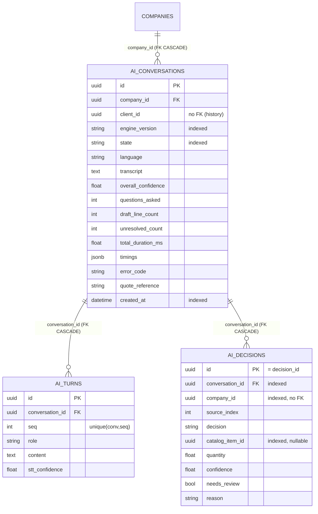

# V3.3 — Persistance des conversations IA — Schéma & rapport

> **Statut : ✅ livré.** La persistance des conversations Voice-to-Quote, **branchée exclusivement via
> `EventSink`**, sans que l'orchestrateur ne connaisse la base. Migration Alembic appliquée. Zéro
> régression : **242 tests backend verts** (236 + 6 nouveaux).

Suite du [Voice Orchestrator](07_VOICE_ORCHESTRATOR.md). Module : `app/ai_conversations/`.

---

## 1. Contraintes du lot — comment chacune est tenue

| # | Contrainte | Réponse |
|---|---|---|
| 1 | **L'orchestrateur reste ignorant de la base** | `app/voice_quote/` n'importe jamais `ai_conversations`/`database`/`sqlalchemy` — dépendance à sens unique `ai_conversations → voice_quote`, **prouvée par test statique `ast`** (§7). |
| 2 | **Toute la persistance passe par `EventSink`** | `PersistingEventSink` est le **seul** écrivain ; il ne consomme que des `VoiceEvent`. Aucun service/routeur n'écrit dans `ai_*`. |
| 3 | **`engine_version` sur chaque conversation** | Émise dans `CONVERSATION_STARTED`, stockée en `ai_conversations.engine_version` (indexée). |
| 4 | **`decision_id` unique par décision IA** | Généré par l'orchestrateur (`DraftLine`/`UnresolvedItem.decision_id`, uuid), transporté par l'événement, devient la **PK** `ai_decisions.id`. |
| 5 | **Aucune logique métier dans `ai_*`** | Enregistrements bruts : pas de prix/total/TVA, pas de colonne calculée, pas de trigger. `quantity`/`confidence` en `Float` (suggestions, pas source financière). |
| 6 | **Migrations Alembic** | `5be460d241c5_add_ai_conversation_tables.py` (autogénérée, revue), `alembic upgrade head` appliqué. |
| 7 | **Index pour les recherches futures** | 8 index, chacun justifié (§5). |
| 8 | **Champs pour analyses statistiques** | engine_version, state, confidences, timings, compteurs, error, quote_reference, outcome par décision (§6). |

---

## 2. Schéma relationnel complet

### `ai_conversations` — une conversation (résumé mutable + projection d'état)

| Colonne | Type | Null | Clé / Index | Rôle |
|---|---|---|---|---|
| `id` | uuid | non | **PK** | = `conversation_id` de l'orchestrateur |
| `company_id` | uuid | non | **FK** companies (CASCADE), idx | tenant |
| `client_id` | uuid | oui | — (pas de FK) | client au moment de la capture |
| `engine_version` | str | non | idx | version du moteur (#3) |
| `language` | str | non | — | langue de la conversation |
| `state` | str | non | idx | état courant/final (machine à états) |
| `transcript` | text | non | — | transcription accumulée |
| `overall_confidence` | float | oui | — | confiance moyenne du brouillon |
| `questions_asked` | int | non | — | nb de questions posées |
| `draft_line_count` | int | non | — | nb de lignes retenues |
| `unresolved_count` | int | non | — | nb de prestations non résolues |
| `total_duration_ms` | float | oui | — | somme des timings (latence) |
| `timings` | jsonb | non | — | `{étape: ms}` (latence par étape) |
| `error_code` / `error_message` | str | oui | — | échec éventuel |
| `quote_reference` | str | oui | — | n° du devis si créé (conversion) |
| `created_at` | datetime | non | idx | horodatage |
| `updated_at` | datetime | non | — | horodatage |

### `ai_turns` — un tour de parole (append-only)

| Colonne | Type | Null | Clé / Index | Rôle |
|---|---|---|---|---|
| `id` | uuid | non | **PK** | identifiant |
| `conversation_id` | uuid | non | **FK** ai_conversations (CASCADE) | rattachement |
| `seq` | int | non | **unique** (conversation_id, seq) | ordre dans la conversation |
| `role` | str | non | — | `user` \| `assistant` |
| `content` | text | non | — | transcription / question / réponse |
| `stt_confidence` | float | oui | — | confiance STT (tours `user`) |
| `created_at`/`updated_at` | datetime | non | — | horodatage |

### `ai_decisions` — une décision IA par ligne retenue **ou** omise (append/replace)

| Colonne | Type | Null | Clé / Index | Rôle |
|---|---|---|---|---|
| `id` | uuid | non | **PK** | = `decision_id` (#4) |
| `conversation_id` | uuid | non | **FK** ai_conversations (CASCADE), idx | rattachement |
| `company_id` | uuid | non | idx (pas de FK) | tenant dénormalisé (analytics) |
| `source_index` | int | non | — | index de la prestation source |
| `decision` | str | non | — | `include` \| `clarify` \| `omit` |
| `catalog_item_id` | uuid | oui | idx | article retenu (null si omis) |
| `designation` | str | oui | — | libellé de l'article |
| `description` | str | oui | — | texte de la prestation (si omise) |
| `quantity` | float | oui | — | quantité suggérée |
| `confidence` | float | oui | — | confiance composée de la ligne |
| `needs_review` | bool | oui | — | bande « à relire » |
| `reason` | str | oui | — | pourquoi (explicabilité) |
| `created_at`/`updated_at` | datetime | non | — | horodatage |

---

## 3. Diagramme entité-relation



Choix de clés étrangères, justifiés :
- **`company_id → companies` (CASCADE)** est la **seule** vraie FK : c'est la frontière tenant, et
  supprimer une entreprise (RGPD) doit effacer ses conversations, qui cascadent vers turns/decisions.
- **`client_id` et `catalog_item_id` = UUID sans FK** : l'historique IA doit **survivre** à la
  suppression/désactivation d'un client ou d'un article. Une FK `RESTRICT` bloquerait ces
  suppressions ; une FK `CASCADE`/`SET NULL` réécrirait l'histoire. Un enregistrement d'analyse ne fait
  ni l'un ni l'autre.
- **`ai_decisions.company_id` dénormalisé (sans FK)** : permet les analyses par tenant sans jointure ;
  le nettoyage se fait quand même via le CASCADE de `conversation_id`.

---

## 4. Flux de persistance (événement → écriture)

`PersistingEventSink` traduit chaque `VoiceEvent`. Une transaction par événement ; en cas d'erreur,
rollback + log, **la conversation continue** (résilience testée).

| Événement | Écriture |
|---|---|
| `conversation_started` | INSERT `ai_conversations` (id, company_id, client_id, language, **engine_version**, state=idle) |
| `state_changed` | UPDATE `ai_conversations.state` |
| `transcript_ready` | INSERT `ai_turns` (role=user) + append `transcript` |
| `question_raised` | INSERT `ai_turns` (role=assistant) + `questions_asked += 1` |
| `answer_applied` | INSERT `ai_turns` (role=user, la réponse) |
| `draft_updated` | **REPLACE** `ai_decisions` de la conversation + MAJ compteurs/confiance |
| `metric_recorded` | merge `timings[étape]` + recalcul `total_duration_ms` |
| `step_failed` | UPDATE `error_code` / `error_message` |
| `completed` | UPDATE `quote_reference` |

Une **révision** (adjustment #4) ré-émet `draft_updated` → les décisions sont **remplacées**, pas
dupliquées (testé).

---

## 5. Justification de chaque index

| Index | Table | Justifie |
|---|---|---|
| `ix_ai_conversations_company_id` | conversations | **Isolation tenant** : toute lecture filtre par entreprise ; index obligatoire. |
| `ix_ai_conversations_created_at` | conversations | **Analyses temporelles** (volumétrie par jour/semaine) et listing « récentes d'abord ». |
| `ix_ai_conversations_engine_version` | conversations | **Comparaison de versions** du moteur (taux de conversion/confiance par `engine_version`). |
| `ix_ai_conversations_state` | conversations | **Taux d'issue** : compter created / abandoned / failed ; filtrer les échecs. |
| `uq_ai_turns_conversation_id_seq` | turns | **Unicité + lecture ordonnée** : garantit l'ordre et sert `WHERE conversation_id ORDER BY seq` (rejeu du dialogue). |
| `ix_ai_decisions_conversation_id` | decisions | **Explicabilité** : récupérer toutes les décisions d'une conversation (« pourquoi cette ligne ? »). |
| `ix_ai_decisions_company_id` | decisions | **Analyses par tenant sans jointure** (taux d'omission, confiance moyenne par entreprise). |
| `ix_ai_decisions_catalog_item_id` | decisions | **Fréquence de suggestion d'articles** : « articles les plus proposés/retenus » (recherche future). |

*Choix assumés :* pas d'index sur `decision` (faible cardinalité : un `GROUP BY` scanne aussi vite) ni
composite `(company_id, created_at)` pour l'instant — à ajouter si le listing tenant+temps devient un
point chaud. Chaque index a un coût en écriture ; on n'en pose que de justifiés.

---

## 6. Champs prévus pour les analyses statistiques

| Question analytique future | Champs mobilisés |
|---|---|
| Taux de conversion (devis créé / conversation) | `state`, `quote_reference` |
| Taux d'abandon / d'échec | `state`, `error_code` |
| Latence du pipeline (p50/p95) | `total_duration_ms`, `timings` (par étape) |
| Combien de questions en moyenne | `questions_asked` |
| Qualité de compréhension | `overall_confidence`, `ai_decisions.confidence`, `ai_turns.stt_confidence` |
| Distribution des décisions | `ai_decisions.decision` (include/clarify/omit) |
| Articles les plus suggérés | `ai_decisions.catalog_item_id` |
| Raisons d'omission les plus fréquentes | `ai_decisions.reason` (decision=omit) |
| Comparaison entre versions du moteur | `engine_version` croisé avec tout ce qui précède |
| Mix linguistique | `language` |

---

## 7. Preuve : l'orchestrateur n'a aucune dépendance métier

1. **Dépendance à sens unique.** `app/ai_conversations/` importe `app/voice_quote` (events, schemas) ;
   `app/voice_quote/` n'importe **jamais** `app/ai_conversations`, ni `app.database`, ni `sqlalchemy`.
2. **Test statique automatique.** `test_voice_orchestrator_never_imports_the_business_database` parse
   par `ast` **tous** les fichiers de `app/voice_quote/` et échoue au moindre import de
   `app.database` / `app.catalog` / `app.quotes` / `app.quote_assistant` / `sqlalchemy`. Il reste vert
   après ce lot.
3. **Persistance branchée uniquement par port.** L'orchestrateur ne connaît que le `Protocol`
   `EventSink` (défini dans `voice_quote/events.py`, sans aucun import base). `PersistingEventSink` en
   est une implémentation vivant **dehors**.
4. **Résilience.** `test_a_raising_sink_never_breaks_the_conversation` : même si le sink lève,
   l'orchestrateur termine la conversation. La persistance ne peut ni coupler, ni casser le moteur.

```
app/voice_quote/  (moteur pur)  ──émet──►  EventSink (Protocol, pur)
                                               ▲
                                               │ implémente
                              app/ai_conversations/PersistingEventSink ──► ai_* (base)
        (le moteur ne voit jamais cette flèche)
```

---

## 8. Migration

`backend/alembic/versions/5be460d241c5_add_ai_conversation_tables.py`
(`down_revision = 6cc7943bff6a`). Crée les 3 tables + 8 index + contrainte unique. `downgrade` les
supprime ; aucun type ENUM à nettoyer (états/décisions stockés en `String`, volontairement — le jeu
d'états du moteur peut évoluer sans DDL).

**Prochain lot (sur validation) :** adaptateurs concrets des ports (`ServiceExtractor` LLM,
`CatalogMatcher` réutilisant `MatchValidator` + dépôt catalogue), puis l'API + le temps réel (SSE) qui
câbleront `VoiceOrchestrator` + `PersistingEventSink` derrière `POST /ai/voice-quote`.
